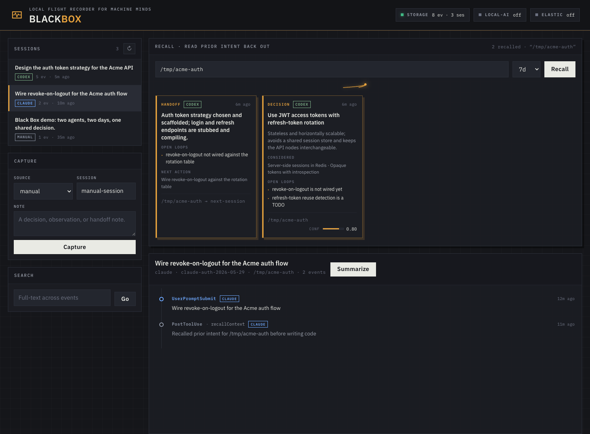

# Black Box

**A local flight recorder for machine minds.** Your coding agents reason out loud all day — deciding, weighing alternatives, leaving loose ends — and then forget it the moment the session ends. Black Box is the recorder they write that reasoning into, and the one place a *different* agent can fly back into mid-task to recall what was already decided.

`Java 21` · `Spring Boot` · `SQLite` · `MCP` · `local-first storage` · `Codex summaries`

<!-- Still captured from ./scripts/demo.sh — swap in an animated hero.gif of the live recall when you record one. -->


> Captured from `./scripts/demo.sh`. Run the demo, then record the recall moment to replace this still with a GIF.

## The clever bit

Black Box owns one verb the read-only tools don't: **write + query**. Agents call MCP tools to *commit* structured intent and to *recall* it back out at runtime — not raw transcript text, but the decision, its rationale, the alternatives rejected, the open loops, and a confidence score.

- `captureDecision` / `captureHandoff` — an agent writes down what it chose and why, and what it's leaving for whoever comes next.
- `recallContext` — a later agent asks "what was already settled here?" before redoing the thinking.

A concrete loop: yesterday a **Codex** session committed a `Decision` — *"Keep SQLite as the source of truth; Elasticsearch is optional indexing"* — with its rationale and an open loop. Today a fresh **Claude Code** session opens in the same repo, calls `recallContext`, and that exact decision comes back into its context window before it touches a line. Two agents sharing one thought through a third thing that remembers for both.

## Quickstart

One command — starts the app, seeds a demo decision/handoff, and shows the recall:

```bash
./scripts/demo.sh
```

Or the manual path:

```bash
mvn spring-boot:run
# then open the control surface:
open http://localhost:8766
```

Sanity check:

```bash
curl -fsS http://localhost:8766/api/status | jq
```

## Privacy

Black Box storage stays local: your agents' transcripts, decisions, and handoffs live in a local SQLite file. Session summaries are owned by Black Box and default to the bundled Codex CLI wrapper, so summary generation can send transcript text to Codex cloud. Set `SBA_SUMMARY_BACKEND=local` when you explicitly want the LM Studio/OpenAI-compatible local model path instead.

## Black Box vs. agent-observatory

[agent-observatory](https://github.com/nathanmauro/agent-observatory) is read-only filesystem discovery — a **telescope** that watches what agents already wrote to disk. Black Box is the writable, queryable MCP memory bus agents deliberately call *back into* — the **nervous system**. The telescope observes; the recorder remembers and answers. They're complementary.

---

## Reference

### Requirements

- Java 21+
- Maven 3.9+
- `jq` (for the hook bridge)
- Codex CLI authenticated for `codex exec` — used by the default summary backend
- A local OpenAI-compatible model server such as LM Studio — *optional*, only used when `SBA_SUMMARY_BACKEND=local`
- Elasticsearch — *optional*, a secondary search index; SQLite is always the source of truth

### Configuration

Configuration is environment variables; defaults live in `src/main/resources/application.yml`.

| Variable | Default | Use |
| --- | --- | --- |
| `SBA_PORT` | `8766` | HTTP server port |
| `SBA_DATASOURCE_URL` | `jdbc:sqlite:sba-agentic.db` | SQLite database location |
| `SBA_SUMMARY_BACKEND` | `external` | Summary owner backend: Codex wrapper by default, or `local` for the local AI path |
| `SBA_SUMMARY_EXTERNAL_COMMAND` | `scripts/summarize-with-codex.sh` | External summary command used when `SBA_SUMMARY_BACKEND=external` |
| `SBA_SUMMARY_TIMEOUT` | `10m` | Maximum runtime for the external summary command |
| `SBA_SUMMARY_CODEX_BIN` | `/opt/homebrew/bin/codex` | Codex executable used by the bundled external summary wrapper |
| `SBA_SUMMARY_CODEX_AUTH` | `$CODEX_HOME/auth.json` or `~/.codex/auth.json` | Auth file symlinked into the wrapper's temporary Codex home |
| `SBA_SUMMARY_CODEX_MODEL` | unset | Optional model override passed to `codex exec` |
| `SBA_LOCAL_AI_ENABLED` | `true` | Enables the optional local AI client when `SBA_SUMMARY_BACKEND=local` |
| `SBA_LOCAL_AI_BASE_URL` | `http://localhost:1234` | LM Studio / OpenAI-compatible base URL |
| `SBA_LOCAL_AI_CHAT_PATH` | `/v1/chat/completions` | Chat completion path |
| `SBA_LOCAL_AI_MODEL` | `local-model` | Model id sent to the local AI server |
| `SBA_LOCAL_AI_API_KEY` | `lm-studio` | Bearer token value for local AI requests |
| `SBA_ELASTICSEARCH_ENABLED` | `false` | Enables optional Elasticsearch indexing/search |
| `SBA_ELASTICSEARCH_URL` | `http://localhost:9200` | Elasticsearch base URL |
| `SBA_ELASTICSEARCH_INDEX` | `sba-agentic-events` | Elasticsearch index name |

The hook bridge also reads:

| Variable | Default | Use |
| --- | --- | --- |
| `SBA_AGENTIC_URL` | `http://localhost:8766` | Target Black Box server |
| `SBA_AGENT_SOURCE` | first script argument or `unknown` | Source label, e.g. `claude` or `codex` |

Point at a database outside the repo, or explicitly use the local model path:

```bash
SBA_DATASOURCE_URL='jdbc:sqlite:/path/to/black-box.db' mvn spring-boot:run
SBA_SUMMARY_BACKEND=local mvn spring-boot:run
```

### MCP tools

Black Box exposes a streamable HTTP MCP server at `http://localhost:8766/mcp`.

| Tool | Verb | What it does |
| --- | --- | --- |
| `captureDecision` | write | Commit a decision with rationale, alternatives, confidence, open loops |
| `captureHandoff` | write | Leave context, open loops, and a next action for the next agent |
| `captureObservation` | write | Drop a free-form note into the recorder |
| `recallContext` | query | Pull structured prior decisions/handoffs by repo or topic + time window |
| `searchSessions` | query | Free-text search across captured events |
| `recentSessions` | query | List recently captured sessions |
| `localModelStatus` | query | Health of the optional local model backend |

Register with Codex:

```bash
codex mcp add sba-agentic --url http://localhost:8766/mcp
codex mcp list
```

Register with Claude Code:

```bash
claude mcp add --transport http --scope user sba-agentic http://localhost:8766/mcp
claude mcp list
```

Restart the client after registration if the tools don't appear.

### Hook capture (local, opt-in)

The hook bridge reads a Claude Code or Codex hook payload on stdin, normalizes the common fields, and POSTs an event to `/api/events`. Wiring it up is entirely opt-in and stays local to your machine — no private hook config is committed to this repo. When Black Box ingests a final lifecycle event (`SessionEnd` or the debounced Codex `Stop`), Black Box schedules the session summary internally through its configured summary backend.

Script: `scripts/hooks/sba-agent-hook.sh`

Smoke test:

```bash
printf '{"hook_event_name":"UserPromptSubmit","session_id":"hook-test","prompt":"hello from hook","cwd":"%s"}' "$PWD" |
  SBA_AGENT_SOURCE=manual scripts/hooks/sba-agent-hook.sh
```

Claude Code (`UserPromptSubmit` / `PostToolUse`), in your local settings:

```json
{
  "hooks": {
    "UserPromptSubmit": [
      { "hooks": [ { "type": "command", "command": "SBA_AGENT_SOURCE=claude SBA_AGENTIC_URL=http://localhost:8766 /ABSOLUTE/PATH/TO/scripts/hooks/sba-agent-hook.sh" } ] }
    ],
    "PostToolUse": [
      { "hooks": [ { "type": "command", "command": "SBA_AGENT_SOURCE=claude SBA_AGENTIC_URL=http://localhost:8766 /ABSOLUTE/PATH/TO/scripts/hooks/sba-agent-hook.sh" } ] }
    ]
  }
}
```

Codex (`.codex/hooks.json`, local to the repo or your machine) uses the same command shape with `SBA_AGENT_SOURCE=codex`. Replace `/ABSOLUTE/PATH/TO/...` with the path on your machine. Hook config formats vary by client version — keep the command identical and adapt the surrounding shape.

For the current workstation's installed hook behavior, timeout expectations, and the distinction between visible hook status and model-visible context injection, see [`docs/local-writes-and-elasticsearch.md#hook-behavior-on-this-workstation`](docs/local-writes-and-elasticsearch.md#hook-behavior-on-this-workstation).

### HTTP API

All endpoints are served at `http://localhost:8766`.

**Write**

| Method · Path | Body / purpose |
| --- | --- |
| `POST /api/decisions` | `{ source, clientSessionId, repo, decision, rationale, alternatives[], confidence, openLoops[] }` |
| `POST /api/handoffs` | `{ source, clientSessionId, repo, toAgent, contextSummary, openLoops[], nextAction }` |
| `POST /api/events` | `{ source, clientSessionId, eventType, role, text, cwd, metadata, observedAt }` |

**Query**

| Method · Path | Returns |
| --- | --- |
| `GET /api/recall?scope=<repo-or-topic>&withinHours=168&kinds=decision,handoff` | Structured recalled decisions/handoffs |
| `GET /api/sessions?limit=40` | Recent sessions |
| `GET /api/sessions/{id}/events?limit=100` | A session's events (newest first) |
| `GET /api/search?q=<text>&limit=25` | Local (and optional Elasticsearch) search hits |
| `GET /api/status` | Storage counts + local AI / Elasticsearch health |
| `POST /api/sessions/{id}/summarize` | Summarizes a session through the configured Black Box summary backend (Codex cloud by default) |
| `POST /api/sessions/summarize?source=codex&clientSessionId=<id>` | Summarizes the same session by hook/client ids |
| `POST /api/sessions/summarize-missing?limit=10` | Backfills recent sessions missing summaries, capped per call |
| `GET /api/exports/targets` | Lists configured summary export targets |
| `POST /api/sessions/{id}/exports/{targetId}` | Writes that session's existing summary to the selected export target |

Examples:

```bash
# Commit a decision
curl -fsS -H 'Content-Type: application/json' -X POST http://localhost:8766/api/decisions \
  --data '{
    "source": "codex",
    "clientSessionId": "codex-42",
    "repo": "/repos/black-box",
    "decision": "Keep SQLite as the source of truth; Elasticsearch is optional indexing",
    "rationale": "Local-first, zero external deps for the core loop",
    "alternatives": ["Elasticsearch-primary", "Postgres + pgvector"],
    "confidence": 0.8,
    "openLoops": ["Decide on backfill for pre-existing rows"]
  }' | jq

# Recall it from a later session
curl -fsS 'http://localhost:8766/api/recall?scope=/repos/black-box&withinHours=168&kinds=decision,handoff' | jq
```

### CLI

```bash
mvn -DskipTests package
java -jar target/sba-agentic-0.1.0-SNAPSHOT.jar doctor
java -jar target/sba-agentic-0.1.0-SNAPSHOT.jar ingest --source=manual --session=test --type=ManualCapture --text='first note'
java -jar target/sba-agentic-0.1.0-SNAPSHOT.jar search 'first note'
java -jar target/sba-agentic-0.1.0-SNAPSHOT.jar sessions --limit=10
java -jar target/sba-agentic-0.1.0-SNAPSHOT.jar summarize <session-id>
java -jar target/sba-agentic-0.1.0-SNAPSHOT.jar summarize-missing --limit=10
```

The CLI reads the same environment variables as the server — set `SBA_DATASOURCE_URL` to share a database between them.

Session summaries are owned by Black Box. The default backend is external Codex cloud via
`scripts/summarize-with-codex.sh`; set `SBA_SUMMARY_BACKEND=local` only when you explicitly want the
LM Studio/OpenAI-compatible local model path. External summary failures fail closed instead of
silently falling back to local inference. The bundled Codex wrapper disables hooks and ignores
Codex user/project rules while summarizing. It also runs with a temporary auth-only `CODEX_HOME`,
so the summary worker does not load separate MCP, skills, plugins, memory, or agent-continuity
surfaces.

Summary export is opt-in. The shipped example target is Obsidian, implemented as a configurable `markdown-file` target that uses the bundled Mustache template at `classpath:/exports/summary-markdown.mustache`. Override its directory with `SBA_EXPORT_OBSIDIAN_DIR`, or define your own `sba.exports.targets[]` entries:

```yaml
sba:
  exports:
    targets:
      - id: team-wiki
        label: Team Wiki
        type: markdown-file
        directory: /path/to/exported/summaries
        template: file:/path/to/summary-template.mustache
        subdirectory-template: "{{month}}"
        filename-template: "{{source}}-{{slug}}-{{shortId}}.md"
```

Templates receive fields such as `title`, `summary`, `source`, `cwd`, `date`, `month`, `slug`, `shortId`, `sessionId`, `clientSessionId`, `startedAt`, `lastSeenAt`, and `eventCount`.

### Data model

SQLite is the canonical store. Tables are created from `src/main/resources/schema.sql`.

- `agent_sessions` — one row per `(source, clientSessionId)`; carries the session title (seeded from `metadata.title`, then the first prompt, then a tool/event fallback, truncated to 96 chars — later events do not retitle an existing session today).
- `agent_events` — individual prompts, tool events, manual notes, observations, and the structured `Decision` / `Handoff` events whose fields live in `metadata`.

Delete the database file (`sba-agentic.db` by default) only to wipe local captured history.

### Optional: Elasticsearch

Elasticsearch is a secondary index, not the source of truth. When enabled, new events are mirrored into it as they're written; existing SQLite rows are not backfilled. See [`docs/local-writes-and-elasticsearch.md`](docs/local-writes-and-elasticsearch.md) for the full write paths, verification, and stop commands.

```bash
docker compose -f compose.elasticsearch.yml up -d
SBA_ELASTICSEARCH_ENABLED=true mvn spring-boot:run
```

Kibana is available as an optional Compose profile for inspecting the local index:

```bash
docker compose -f compose.elasticsearch.yml --profile kibana up -d kibana
```

Then open `http://localhost:5601`.

### Architecture

See [`docs/architecture.md`](docs/architecture.md) for the write + query loop and a diagram.

### Tests

```bash
mvn test
```

## License

[MIT](LICENSE) © 2026 Nathan Mauro
