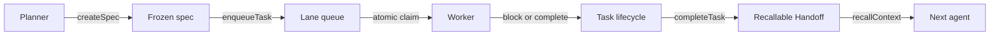
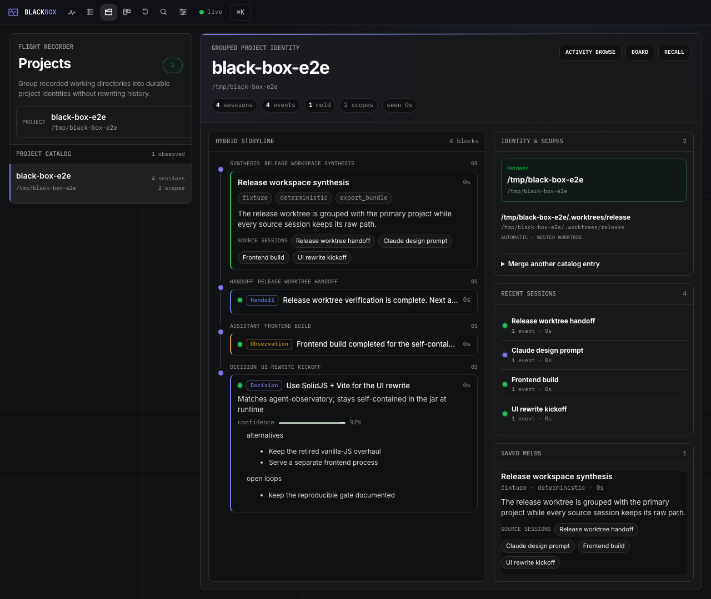
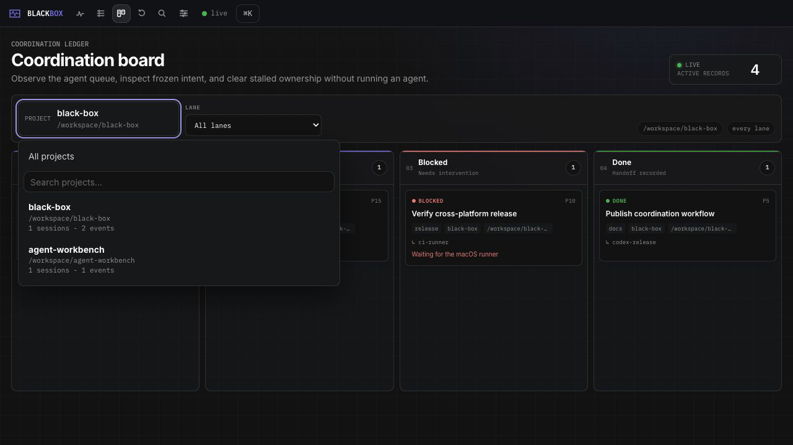
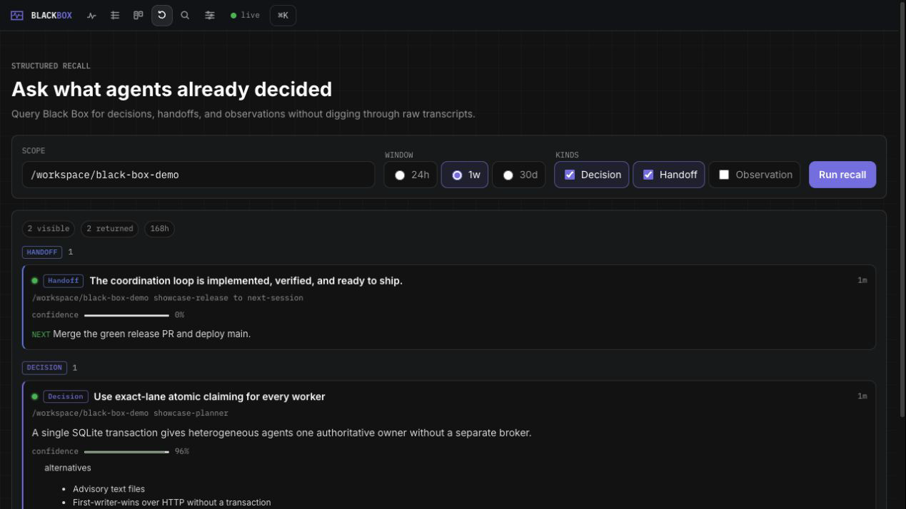

<div align="center">
  
  <h1>Black Box</h1>
  <p><strong>Local-first memory and coordination for coding agents.</strong></p>
  <p>
    Preserve decisions. Claim work atomically. Leave typed handoffs.<br>
    Let the next agent start with context instead of archaeology.
  </p>

  <p>
    <a href="https://github.com/nathanmauro/black-box/actions/workflows/ci.yml"></a>
    <a href="https://openjdk.org/projects/jdk/21/"></a>
    <a href="http://localhost:8766/mcp"></a>
    <a href="LICENSE"></a>
  </p>
</div>


Black Box is a writable memory bus and coordination ledger for Codex, Claude Code, and other MCP
clients. Agents commit the reasoning worth preserving, coordinate through a SQLite-backed task
queue, and recall exact decisions or completion handoffs in later sessions.

The Black Box server is deliberately not an agent runner. It records intent, arbitrates ownership,
and exposes state; your agents and orchestrators still execute the work.

| Remember | Coordinate | Observe | Stay local-first |
| --- | --- | --- | --- |
| Typed Decisions, Handoffs, Observations, alternatives, confidence, and open loops | Frozen specs, exact-lane queues, atomic claims, lifecycle rules, and completion Handoffs | Activity, logical Projects, project-aware Board, structured Recall, search, SSE updates, and stats | SQLite is authoritative; Elasticsearch and model-backed features are optional |

## The loop



1. A planner freezes the work definition and enqueues lane-specific tasks.
2. A worker atomically claims the highest-priority, oldest task in its exact lane.
3. Every transition is validated and recorded; stalled work can be blocked and explicitly reset.
4. Completion creates a normal Black Box Handoff and links it to the task.
5. A later agent recalls the result directly instead of reconstructing it from transcripts.

The task path never launches a worker, executes a command, or mutates a checkout. SSE frames are
wake-up hints; `claimNextTask` and `listTasks` remain authoritative.

## See it

### Follow a whole project storyline



Group verified worktrees under one logical identity, inspect the newest high-signal evidence, and
pivot into Activity, the exact-scope Board, or Recall without rewriting recorded history.

| Coordination Board | Structured Recall |
| --- | --- |
|  |  |
| Inspect frozen intent, ownership, blockers, priorities, and linked completion Handoffs. | Query Decisions and Handoffs by repo or topic without reading raw transcripts. |

## Start in 60 seconds

Requirements: Java 21+, Maven 3.9+, `curl`, and `jq`.

```bash
git clone https://github.com/nathanmauro/black-box.git
cd black-box
./scripts/quickstart.sh
```

The quickstart builds the jar, starts an isolated demo database, seeds a cross-agent story, proves
recall, and opens the UI at [localhost:8766](http://localhost:8766).

Already built?

```bash
./scripts/demo.sh
```

Want the complete coordination loop without touching your live database?

```bash
./scripts/demo-agent-loop.sh --dry-run
./scripts/demo-agent-loop.sh --run-isolated
```

Run the app directly:

```bash
mvn spring-boot:run
curl -fsS http://localhost:8766/api/status | jq
```

## Connect an agent

Black Box exposes MCP over Streamable HTTP at `http://localhost:8766/mcp`.

Codex:

```bash
codex mcp add sba-agentic --url http://localhost:8766/mcp
codex mcp list
```

Claude Code:

```bash
claude mcp add --transport http --scope user sba-agentic http://localhost:8766/mcp
claude mcp list
```

Restart the client if the tools do not appear. The server keeps the historical MCP id
`sba-agentic`; the product name is Black Box.

### Memory tools

| Tool | Purpose |
| --- | --- |
| `captureDecision` | Preserve a choice, rationale, rejected alternatives, confidence, and open loops |
| `captureHandoff` | Leave context, open loops, and one next action for another agent |
| `captureObservation` | Record a concise fact or note |
| `recallContext` | Recall structured Decisions and Handoffs by repo, topic, or event id |
| `searchSessions` | Search captured events and sessions |
| `recentSessions` | List recent agent sessions |
| `localModelStatus` | Inspect the optional local model backend |

### Coordination tools

| Tool | Purpose |
| --- | --- |
| `createSpec` | Freeze a work definition under the catalog's canonical project scope or path |
| `enqueueTask` | Add an open task to one exact lane |
| `claimNextTask` | Atomically claim the highest-priority, oldest eligible task |
| `updateTaskStatus` | Block, reset, or cancel through the allowed lifecycle |
| `completeTask` | Complete owned work and atomically link a recallable Handoff |
| `listTasks` | Query full task/spec snapshots by project, lane, or status |
| `getSpec` | Retrieve the frozen spec body and provenance |

REST mirrors the seven coordination operations exactly. Successful REST and MCP results share field
names and ISO-8601 timestamps; failures use stable typed error envelopes. See
[Architecture](docs/architecture.md) for the full contract and transaction boundaries.

## A minimal agent handoff

The syntax below is illustrative; MCP clients render tool calls differently.

```text
createSpec({
  "projectKey": "/workspace/example-app",
  "title": "Add a health probe",
  "body": "Implement GET /healthz and prove a 200 response.",
  "actor": "planner"
})

enqueueTask({
  "specId": "<returned-spec-id>",
  "title": "Implement and verify the health probe",
  "lane": "codex",
  "priority": 10,
  "actor": "planner"
})

claimNextTask({"lane": "codex", "agent": "worker-1"})

completeTask({
  "taskId": "<returned-task-id>",
  "actor": "worker-1",
  "source": "codex",
  "clientSessionId": "health-probe-run",
  "summary": "Implemented and verified GET /healthz.",
  "openLoops": [],
  "nextAction": "Run the release gate."
})

recallContext({
  "repoOrTopic": "<returned-resultHandoffId>",
  "withinHours": 24,
  "kinds": ["handoff"]
})
```

## Product surfaces

- **Activity** — the global event stream, session browser, faceted Find workspace, and optional Ask
  surface.
- **Projects** — a searchable logical-project workspace that groups verified worktree scopes without
  rewriting recorded paths. Inspect constituent scopes, recent sessions, Hybrid Storyline evidence,
  and saved synthesis, or explicitly merge and undo ambiguous catalog scopes.
- **Board** — searchable catalog-project and lane filters over explicitly queued Open, In Progress,
  Blocked, and Done tasks, with frozen spec and linked-Handoff detail. Selecting a project does not
  infer tasks from Activity, sessions, or external systems; use its canonical scope or path as
  `createSpec.projectKey` when enqueueing work.
- **Recall** — focused Decision, Handoff, and Observation retrieval by repo or topic.
- **Search** — local SQLite search with optional Elasticsearch results.

Open them directly:

- [Activity](http://localhost:8766/)
- [Projects](http://localhost:8766/projects)
- [Board](http://localhost:8766/board)
- [Recall](http://localhost:8766/recall)
- [Search](http://localhost:8766/search)

## Trust and data boundaries

SQLite is the source of truth for sessions, events, structured memory, specs, tasks, and lifecycle
events. The server binds to `127.0.0.1` by default and has no built-in authentication. Do not expose
it on a network unless you accept that trust model.

Logical project aliases affect catalog, session, storyline, and saved-meld reads only. Black Box
never rewrites historical session/event paths or task/spec project scopes when projects are grouped.
Git-common-directory worktrees and structurally unambiguous worktree paths whose owner still has
Git metadata are discovered automatically; ambiguous or unverified paths require an explicit,
reversible merge in Projects.

Automatic redaction is enabled before persistence for private-key blocks, AWS credentials, bearer
or API tokens, and password/token assignments. Set `SBA_REDACT_ENABLED=false` only when you
deliberately want unredacted local storage.

Core capture, coordination, and recall require no model and no Elasticsearch. Session summaries are
the exception: the default `external` backend invokes the bundled Codex wrapper and can send
transcript text through that vendor path. Set `SBA_SUMMARY_BACKEND=local` to use LM Studio or another
local OpenAI-compatible server instead.

## Board-driven runner modes (optional, config-gated)

Black Box also ships an optional external runner process: `java -jar sba-agentic.jar runner`, a CLI
subcommand alongside `doctor`, `ingest`, `sessions`, and the other maintenance commands. A story
submitted through the Board's New Story form, or through `createSpec` plus `enqueueTask` in lane
`gate`, records either `full_auto` or `sdlc` in its frozen spec and begins with the same deterministic
readiness checks. Both modes use isolated worktrees, configured engines, verification, commits, live
Board updates, and tendrils into worker-session context. A `fake` engine is available for tests.

### FULL_AUTO

Story readiness is the one human gate. A passing gate enqueues an `auto` task whose worker builds,
verifies, and commits the change; the runner then owns shipping. Push, pull-request creation, and
merge occur only when the repo config permits them and the existing fail-closed gates pass.

### SDLC

SDLC adds approval annotations after planning and review: `gate → plan → approval → build → review →
approval → ship`. Plan and review workers receive read-only, no-commit contracts and post `plan` or
`review` annotations before completing their stage with a Handoff. Plan approval enqueues the build
in lane `auto`. The build uses the same execution path through a verified commit, but defers shipping,
records its preserved branch and worktree, and enqueues `sdlc:review`. Review runs against that same
worktree and posts advisory findings; review approval invokes the same shipping path as FULL_AUTO.

Without the matching approval the runner makes no progress. A rejection records the feedback as a
`progress` marker on the already-`done` stage task and enqueues or ships nothing. Approval never
bypasses repo allowlists, danger settings, push and auto-merge configuration, credentials, or green
check requirements.

- The runner requires an explicit machine-local config, selected through `SBA_RUNNER_CONFIG` or
  `~/.blackbox/runner.json` by default. It is never committed; start from
  [`docs/runner-config.example.json`](docs/runner-config.example.json). The config allowlists repos
  and controls push, auto-merge, and danger settings.
- Downstream behavior fails closed in both modes: an unknown repo, danger flag, red check, missing
  approval, or missing credential produces local-only, waiting, or blocked work, never a risky action.
- The Black Box server still never launches a worker or executes a task command. The runner is a
  separate process and an ordinary REST client, like any other agent or orchestrator.

See the [FULL_AUTO architecture](docs/architecture.md#optional-full_auto-runner),
[SDLC architecture](docs/architecture.md#optional-sdlc-runner-mode),
[`FULL_AUTO board-driven runner` design spec](docs/superpowers/specs/2026-07-15-full-auto-board-runner.md),
and [`SDLC mode` design spec](docs/superpowers/specs/2026-07-16-sdlc-mode.md) for the full pipelines
and guardrails.

## Run as a service

macOS launchd:

```bash
./scripts/deploy-local.sh
```

The script builds the frontend and jar, restarts `com.nathan.sba-agentic` by default, and waits for a
healthy status response. Use `scripts/black-box.plist.template` for a first-time LaunchAgent install.

macOS board runner launchd:

`scripts/deploy-runner-local.sh` deploys the already-built jar as the
`com.nathan.blackbox-runner` launchd service. It does not build the jar; run
`scripts/deploy-local.sh` first. Use `scripts/blackbox-runner.plist.template` for a first-time runner
LaunchAgent install.

Running the deploy script by hand starts or restarts the runner. This is not a passive service:
starting it launches autonomous orchestration according to `~/.blackbox/runner.json`. The runner
claims `gate` and `auto` tasks for FULL_AUTO stories and `gate`, `sdlc:plan`, `auto`, and
`sdlc:review` tasks for SDLC stories; it also reacts to SDLC approval annotations. Both modes use the
configured engine, repo, push, and auto-merge settings. Review
[Board-driven runner modes](#board-driven-runner-modes-optional-config-gated) for the full behavior
and [`docs/runner-config.example.json`](docs/runner-config.example.json) for the config shape before
starting it.

Linux systemd:

```bash
cp scripts/black-box.service ~/.config/systemd/user/black-box.service
$EDITOR ~/.config/systemd/user/black-box.service
systemctl --user daemon-reload
systemctl --user enable --now black-box
```

Docker for local development:

```bash
mvn clean -DskipTests package
docker build -t black-box .
docker run --rm -p 127.0.0.1:8766:8766 -v black-box-data:/data black-box
```

## Configuration

Defaults live in `src/main/resources/application.yml`.

| Variable | Default | Purpose |
| --- | --- | --- |
| `SBA_PORT` | `8766` | HTTP port |
| `SBA_BIND_ADDRESS` | `127.0.0.1` | Bind address; network exposure has no built-in auth |
| `SBA_DATASOURCE_URL` | `jdbc:sqlite:sba-agentic.db` | SQLite database location |
| `SBA_REDACT_ENABLED` | `true` | Redact secret-looking text before persistence |
| `SBA_SUMMARY_BACKEND` | `external` | Summary backend; set `local` for an OpenAI-compatible local model |
| `SBA_SUMMARY_EXTERNAL_COMMAND` | `scripts/summarize-with-codex.sh` | External summary command |
| `SBA_LOCAL_AI_BASE_URL` | `http://localhost:1234` | Local OpenAI-compatible server |
| `SBA_ELASTICSEARCH_ENABLED` | `false` | Enable optional secondary search indexing |
| `SBA_ELASTICSEARCH_URL` | `http://localhost:9200` | Optional Elasticsearch endpoint |
| `SBA_EXPORT_OBSIDIAN_DIR` | unset | Enables the built-in Obsidian summary export target |

The hook bridges additionally read `SBA_AGENTIC_URL`, `SBA_AGENT_SOURCE`,
`SBA_RECALL_WITHIN_HOURS`, `SBA_RECALL_LIMIT`, and `SBA_RECALL_MAX_CHARS`. See
[Local writes and Elasticsearch](docs/local-writes-and-elasticsearch.md) for the complete operational
reference.

## Optional capture and recall hooks

Black Box does not capture agent sessions until you opt in.

- `scripts/hooks/sba-agent-hook.sh` normalizes supported Claude Code or Codex hook payloads and posts
  them to `/api/events`. Prompt, final-response, and tool hooks receive semantic `user`, `assistant`,
  and `tool` roles so Browse can reconstruct the recorded conversation.
- `scripts/hooks/sba-recall-hook.sh` recalls recent Decisions and Handoffs for a Claude Code
  `SessionStart` and prints a bounded context block.

Codex sessions should call `recallContext` through MCP near the start of relevant work. A short
instruction in `AGENTS.md` works well.

Hook smoke test:

```bash
scripts/test-agent-hook.sh

printf '{"hook_event_name":"UserPromptSubmit","session_id":"hook-test","prompt":"hello","cwd":"%s"}' "$PWD" |
  SBA_AGENT_SOURCE=manual scripts/hooks/sba-agent-hook.sh
```

## Terminal proof

The demo below is generated from the real isolated decision → handoff → recall flow.

<!-- Generated by ./scripts/record-demo.sh, which records ./scripts/demo.sh. -->


Regenerate it with:

```bash
SBA_DEMO_PORT=8797 ./scripts/record-demo.sh
```

## Develop

```bash
mvn test
cd frontend && npm test
cd frontend && npm run build
cd frontend && npm run e2e
```

The E2E suite starts a packaged jar on an isolated temporary SQLite database and fails closed if its
paths or ownership marker are unsafe. It does not attach to port `8766` or the production database.

For deeper implementation details:

- [Architecture](docs/architecture.md)
- [Agent task queue design](docs/superpowers/specs/2026-06-28-agent-task-queue-design.md)
- [Local writes and Elasticsearch](docs/local-writes-and-elasticsearch.md)

## License

[MIT](LICENSE) © 2026 Nathan Mauro
