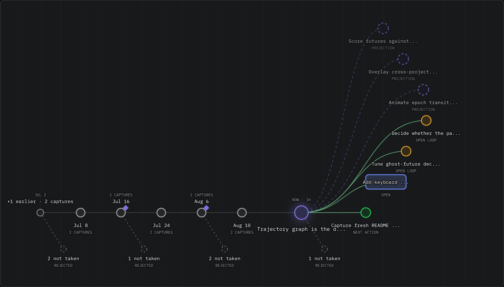
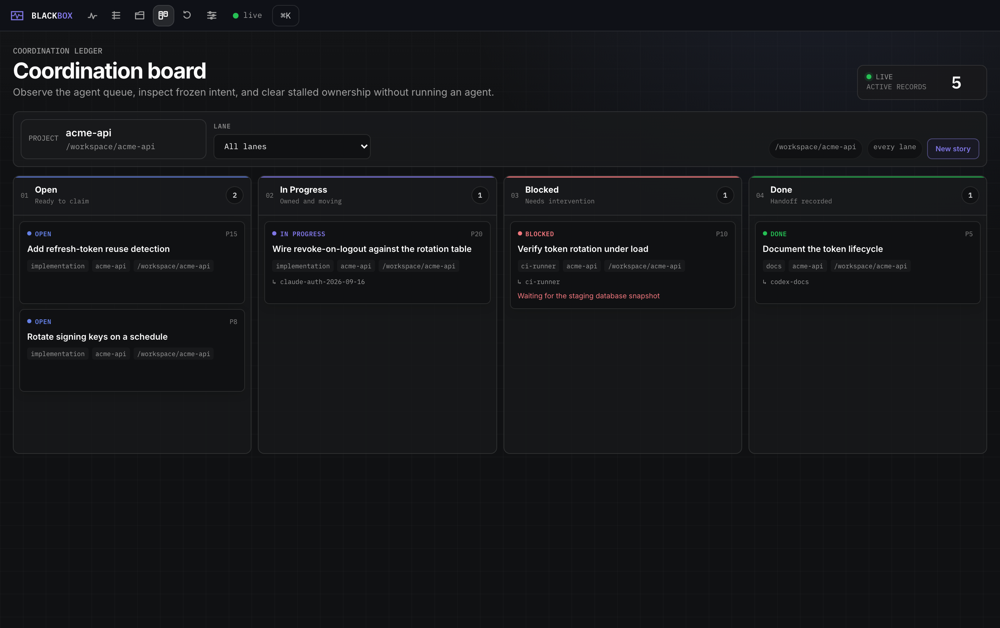
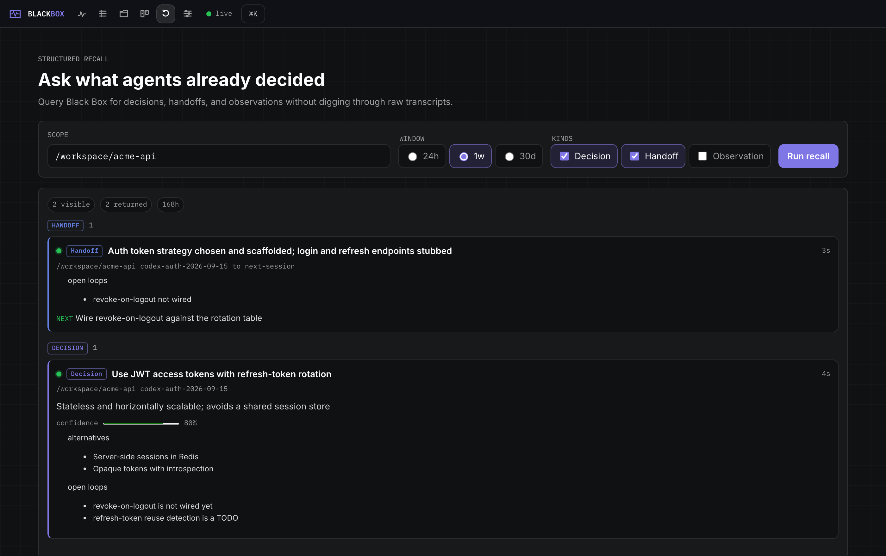
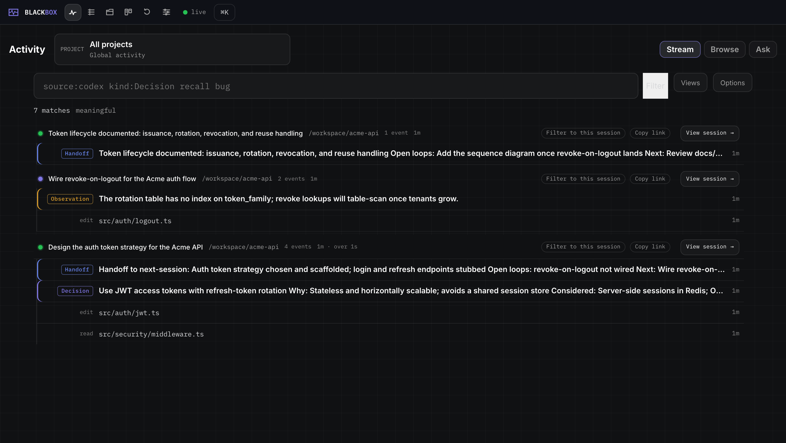
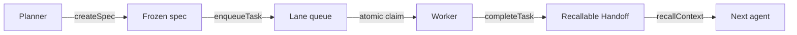

<div align="center">
  
  <h1>Black Box</h1>
  <p><strong>The ledger coding agents write their reasoning into, and read back before they act.</strong></p>
  <p>
    Local-first. Codex and Claude Code share one store.<br>
    The server is deliberately not an agent runner.
  </p>
  <p><sub>Java 21 · Spring Boot · Spring Modulith · SQLite · MCP over Streamable HTTP · SolidJS</sub></p>

  <p>
    <a href="https://openjdk.org/projects/jdk/21/"></a>
    <a href="docs/agent-integration.md"></a>
    <a href="LICENSE"></a>
  </p>
</div>

Every Claude Code or Codex session starts from zero. The reasoning behind yesterday's choices lives
in transcripts nobody rereads, so the next session re-derives it, or quietly re-litigates it. Black
Box is a writable memory bus the agents commit to on purpose: typed **Decisions** (with rejected
alternatives and confidence), **Handoffs** (open loops and one next action), **Observations**, and
**Projections** (ranked possible futures). A later agent, from either vendor, recalls that
structured intent by repo, topic, or event id before it touches code.

The name is the flight recorder. What it records is declared intent, not traces: agents write what
they decided and why, not every token they emitted. The server records, arbitrates ownership, and
exposes state. It never launches a worker or executes a command; an optional, separate runner
process exists for that.

## The smallest useful loop

1. A Codex session ends by committing a Decision: what it chose, why, what it rejected, how sure it is.
2. It leaves a Handoff: current state, open loops, the one next action.
3. A fresh Claude Code session in the same repo calls `recallContext` and gets both back, ranked and
   bounded, before it plans.


The recording above is generated from the real isolated flow by `./scripts/record-demo.sh`.

Recall is pulled, not pushed. An agent asks for context when it needs it, through the MCP tool or an
optional `SessionStart` hook, instead of being handed history it did not ask for. That is a design
choice: a bounded packet an agent requested is worth more than a transcript it has to skim.

## See it



A project's trajectory keeps evidence and possibility visibly apart. The spine is what happened:
bursts of recorded work ending at the latest Handoff. Ahead of the head are the next action, open
tasks, and open loops, all taken from captured records. Dashed ghosts are Projections an agent wrote
before closing its session, shaded by the confidence it declared. Rejected alternatives hang below as
dead stubs. Selecting a node shows the capture behind it, with links to its session, stream slice, or
task where one exists. Ordering is deterministic, not learned, and a declared confidence is a claim,
not a calibrated probability.

| Coordination Board | Structured Recall |
| --- | --- |
|  |  |
| Frozen intent, ownership, blockers, priorities, and the completion Handoff each task links to. | Decisions and Handoffs by repo, topic, event id, or semantic paraphrase, without reading raw transcripts. |

The Activity stream behind both is a keyset-paged feed over every recorded event with full-text
search (SQLite FTS5), query-scoped facet counts, a small query grammar (`kind:Decision last:7d`),
and saved views.



## Try it

The current release is [v0.2.0](https://github.com/nathanmauro/black-box/releases/tag/v0.2.0).
Download the runnable JAR and checksum there, or build from source below. Read the
[upgrade guidance and release boundaries](docs/releases/v0.2.0.md) before replacing an existing installation.

Requirements: Java 21+, Maven 3.9+, `curl`, and `jq`.

```bash
git clone https://github.com/nathanmauro/black-box.git
cd black-box
./scripts/quickstart.sh
```

The quickstart builds the jar, starts an isolated demo database, seeds a cross-agent story, proves
recall, and opens the UI at [localhost:8766](http://localhost:8766). It never touches a database you
already have. Set `SBA_DEMO_PORT` if 8766 is busy.

```bash
./scripts/demo.sh                          # already built: decision → handoff → recall on a scratch DB
./scripts/demo-agent-loop.sh --dry-run     # the coordination loop, without writing anything
mvn spring-boot:run                        # run it directly
```

## Connect an agent

Black Box speaks MCP over Streamable HTTP at `http://localhost:8766/mcp`.

```bash
codex mcp add sba-agentic --url http://localhost:8766/mcp
claude mcp add --transport http --scope user sba-agentic http://localhost:8766/mcp
```

Sixteen tools: nine for memory and status (`captureDecision`, `captureHandoff`, `captureObservation`,
`captureProjection`, `recallContext`, `searchContext`, `searchSessions`, `recentSessions`, `localModelStatus`) and
seven for coordination (`createSpec`, `enqueueTask`, `claimNextTask`, `updateTaskStatus`,
`completeTask`, `listTasks`, `getSpec`). REST mirrors the seven coordination operations with the
same field names on success and typed error envelopes on both surfaces. Opt-in hooks stream raw
sessions in and can pull a bounded recall packet at session start. The full reference, including hook
registration and the complete coordination example, is in
[Agent integration](docs/agent-integration.md).

## Why the implementation matters

- **Finishing work and remembering it are one transaction.** Completing a claimed task validates the
  claimant, captures a normal Handoff, stores its id on the task, and commits the transition together.
  Claiming is a single `UPDATE … RETURNING` in priority-then-FIFO order, with `SKIP LOCKED` on
  PostgreSQL. There is no separate result store to drift out of sync.
- **Recall can say nothing.** Nearest neighbors are not necessarily relevant. Before building semantic
  recall, the raw-text design was measured on six hand-picked paraphrases: recall@1 was 0/6. Task
  prefixes and content distillation took it to 2/6 at recall@1 and 5/6 at recall@5. Rather than guess a
  relevance floor, the cosine distribution of the live corpus was measured and the floor set at 0.61.
  Semantic hits below it are not added, lexical matches always survive, and the score exposed is true
  cosine similarity or null. An empty answer is a real answer.
- **Recall is instrumented for use, not marketed with a benchmark.** Telemetry separates
  semantic attempted, completed, contributed to the fused ranking, and present on the final page. It
  records no content and no user, session, or event identifiers, only a server-generated correlation
  id, and it explicitly does not claim that an agent read or benefited from a result.
- **Degradation is graceful and reported.** No embedder or vector store means lexical recall with
  `mode: "lexical"`. No FTS5 means the LIKE fallback. Optional indexes (Elasticsearch, embeddings) are
  derived and rebuildable; the relational store is canonical.
- **Boundaries are enforced, not described.** A feature-first modular monolith on Spring Modulith:
  ArchUnit rejects cross-module `internal` imports, cycles, and repository access from inbound
  adapters. The one-day refactor that introduced it froze the REST, MCP, and SQLite contracts as
  fixtures before any code moved, so the move had to prove it changed nothing a client could see.
- **One grammar, two runtimes, one fixture.** The stream query language is parsed by a pure Java
  module and a TypeScript port, and both are driven by the same 57-case JSON fixture.
- **The optional runner fails closed.** A separate process, an ordinary REST client, with repository
  allowlists, isolated worktrees, verification gates, and config-gated shipping (push, pull request,
  and merge only where the repo config allows). An unknown repo, a red check, or a missing credential
  produces waiting or blocked work, never a risky action.
- **Verified on 2026-09-17 on this branch.** The Java suite runs 593 tests with 0 failures on both
  macOS and Linux (Temurin 21), skipping the handful gated on a platform or a live model; the
  frontend suite runs 607 tests across 49 files on both. A Playwright suite starts a packaged jar on
  an isolated temporary database, and the hook bridges have their own shell tests. `scripts/verify.sh`
  runs the same gate locally.

## Boundaries

- Semantic recall covers Decisions, Handoffs, and Observations. Projections are recalled lexically. The
  full event corpus is searchable, not semantically indexed.
- SQLite is the default and canonical store. The optional PostgreSQL profile owns a separate canonical
  database for a shared single server; it does not synchronize history and is not safe for multiple
  API replicas.
- The server binds to `127.0.0.1` with no authentication. Network deployment requires the optional
  authentication boundary and HTTPS. A single-owner managed AWS prototype is documented; it is not a
  public service.
- Session summaries default to an external vendor wrapper (the bundled Codex script; a Claude script is
  included), so transcript text can leave the machine in that mode. `SBA_SUMMARY_BACKEND=local` keeps
  it on a local OpenAI-compatible model.
- Secret-looking text is redacted before persistence by default.

## How it evolved

As of `1833e07`: 182 commits between 2026-05-21 and 2026-09-17, 41 dated design specs and plans under
[`docs/superpowers`](docs/superpowers), and several changes of mind along the way.

| When | Era | Marker commits |
| --- | --- | --- |
| May 21 – Jun 10 | Recording becomes reusable intent: the write-and-query loop ships and gets a name | `8b33fcd`, `b6e1a9e`, v0.1.0 |
| Jun 15 – Jul 9 | Sessions become project continuity: SolidJS rewrite, global activity as the front door | `c2f00d3`, `9c4214c` |
| Jul 9 – 17 | Memory acquires ownership rules: frozen specs, lane queues, atomic claims, completion Handoffs, the optional runner | `dac5d52`, `ee70724`, `d3f449a` |
| Jul 20 – 23 | Boundaries become enforceable: modular monolith in a day, proved by frozen contracts; subagent lineage | `97e8616`, `5a4cf1b`, `fb7d8e5` |
| Jul 27 – 28 | Recall earns the right to return nothing: measured diagnostic, hybrid recall, true cosine, measured floor | `da76395`, `15e0f72`, `5c1ceaf` |
| Aug 5 – 22 | History becomes legible and futures stay speculative: trajectory graph, projections, FTS5, saved views | `1f90378`, `f886140`, `bd89abf` |
| Aug 28 – 31 | The read-half audit: is memory actually reaching agents? Bounded recall packets, complete transcripts | `87b6a30` |
| Sep 8 – 17 | Usefulness becomes the question: PostgreSQL and auth profiles, evidence-to-Linear, recall observability | `306adb4`, `1833e07` |

Two corrections worth reading in full: the [stream performance note](docs/superpowers/plans/2026-07-28-stream-perf-notes.md)
that threw out an apparent 85× speedup because the baseline was confounded and kept the missed
164 ms budget on record (fixed to 85 ms the next day), and the
[August audit](docs/superpowers/plans/2026-08-28-wire-the-read-half.md) that asked whether recall was
reaching agents at all and answered honestly. The whole arc, with the three times the project changed
its mind, is in [Evolution](docs/evolution.md).

## It recorded its own history

Black Box has been running against its own repo since 76 minutes after the first commit. As this was
written on 2026-09-17, the store held 215 captures about this project: 25 Decisions, 134 Handoffs,
55 Observations, and 1 Projection, mostly from Claude Code and Codex, plus two from a Grok subagent
that drafted the task-queue design spec. Twenty-two of the 25 Decisions carry a confidence and
eighteen record what was rejected. The count was out of date before the
commit landed, because the agents doing this work kept writing to it.

One of them is why this README does not call anything "first":

> **Decision** (2026-06-10, confidence 0.85, condensed): Black Box launch positioning pivots to typed
> decisions bundled with raw-event recording, summaries, and a web UI in one zero-dependency local
> app, not "first local-first cross-agent MCP memory."
> **Rejected:** keep the "first cross-agent local memory" framing (refuted by prior art); compete with
> claude-mem on capture volume (lost cause); reposition as production observability (wrong audience).

The one Projection, written on 2026-08-06 by the session that had just shipped projections, can be
graded against what happened next:

| Projected path | Declared confidence | Outcome |
| --- | --- | --- |
| Merge the trajectory graph to main | 0.8 | Landed on main by 2026-08-19 |
| Speed up the Timeline tab | 0.6 | Committed 2026-08-14, on main 2026-08-19 |
| Tune trajectory heuristics from real use | 0.5 | Did not happen; the heuristic constants are unchanged since |
| Retire the parked `/graph` page | 0.4 | Did not happen; the route is still there |

The two highest-confidence paths happened and the two lowest did not. That is one data point, not
calibration.

## Where it points

What an agent records changes the evidence the next agent sees, which can change the next decision.
Black Box is built to make that loop visible; whether the loop improves outcomes is still a
hypothesis. The candidates for testing it, none of them shipped:

- **Supersession and use provenance.** Which Decision replaced which, and which evidence a later
  agent actually used, so stale decisions stop reading as standing orders.
- **Projection-to-outcome links.** Promote a ghost to selected work, then link its real outcome back
  to the proposal, and keep interventions separate from predictions.
- **Measured continuation quality.** Resumed tasks with and without recall, scored on stale advice,
  missed constraints, and useful next actions. This should precede any productivity claim.
- **Resilient shared continuity.** Durable delivery, workspace boundaries, and leased ownership,
  pursued only when real shared use justifies it.

Each one, with the primitives it builds on and its stop criteria, is in [Futures](docs/futures.md).

## Coordination, when you need it


```mermaid
flowchart LR
    P[Planner] -->|createSpec| S[Frozen spec]
    S -->|enqueueTask| Q[Lane queue]
    Q -->|atomic claim| W[Worker]
    W -->|completeTask| H[Recallable Handoff]
    H -->|recallContext| N[Next agent]
```

A planner freezes the work definition and enqueues lane-specific tasks. A worker atomically claims
the highest-priority, oldest task in its exact lane. Every transition is validated and recorded;
stalled work can be blocked and explicitly reset. Completion creates a normal Handoff linked to the
task, and a later agent recalls it directly. SSE frames are wake-up hints; `claimNextTask` and
`listTasks` stay authoritative. Most of this repo's own use is capture and recall; the queue is there
for when several agents share one board. The optional board-driven runner is described in
[Runner](docs/runner.md).

## How it was built

One maintainer architected, directed, and verified this; most of the code was written by Codex and
Claude Code from the dated specs and plans in this repo, under the working rules in
[`AGENTS.md`](AGENTS.md). Those same agents wrote the 215 records above into Black Box as they went,
which is the shortest version of why it exists. Selected evidence can be published to Linear through
a reconciling, explicitly triggered [prototype](docs/linear-integration.md).

## Develop

To compare agent task outcomes with no history, a plain history file, and Black Box recall, see the
[isolated memory benchmark](docs/memory-benchmark.md). The separate
[local checkpoint evaluation](docs/real-resumption-evaluation.md) measures reconstruction of
historical work. Both retain negative results and distinguish those measurements from demonstrated
product usefulness.

```bash
mvn test                       # Java suite
cd frontend && npm test        # vitest
cd frontend && npm run build   # tsc + vite → src/main/resources/static (committed)
cd frontend && npm run e2e     # Playwright against a packaged jar on an isolated temp DB
./scripts/verify.sh            # all of the above except e2e; add --e2e to include it
git config core.hooksPath scripts/git-hooks   # optional: run verify.sh before every push
```

Deeper reading:

- [Agent integration](docs/agent-integration.md): tools, hooks, lineage, the full coordination example
- [Operations](docs/operations.md): services, Docker, configuration, secure file navigation
- [Runner](docs/runner.md): FULL_AUTO and SDLC modes and their guardrails
- [Companion](docs/companion.md): the chrome-less `/companion` route and the macOS menubar shell
- [Architecture](docs/architecture.md) and [package conventions](docs/architecture/package-conventions.md)
- [Authentication](docs/authentication.md), [PostgreSQL backend](docs/postgres-backend.md),
  [Recall observability](docs/recall-observability.md), [Managed AWS prototype](docs/lightsail-prototype.md)
- [Cross-environment capture](docs/cross-environment-capture.md): origins, minimum schema, handoff template, scope classes
- [Evolution](docs/evolution.md) and [Futures](docs/futures.md)

## License

[MIT](LICENSE) © 2026 Nathan Mauro
