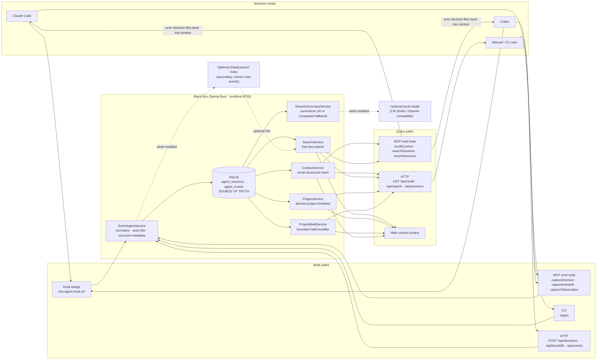

# Architecture

Black Box is a local "flight recorder for machine minds." Its job is one verb the read-only tools don't own: **write + query**. Agents commit structured intent (decisions, handoffs, observations) and read each other's prior reasoning back out at runtime — entirely on localhost, with no file mutation and no cloud.

The whole system is one loop: an agent writes a thought in, the recorder remembers it, and a later agent (possibly a *different* one) flies back in and recalls it mid-task.

## The write + query loop

## Components

- **Write paths (ingress).** Every write — whether it arrives via the hook bridge, an MCP write tool, the CLI, or an HTTP POST — funnels through a single ingest service. There is one front door, so a Codex decision and a Claude Code handoff land in the same shape.
- **`EventIngestService`.** Normalizes the payload, seeds the session title (`metadata.title` → first prompt → tool/event fallback, truncated to 96 chars), and persists the structured fields for `Decision` / `Handoff` / `Observation` events into the event's `metadata`.
- **SQLite — the source of truth.** Two tables (`agent_sessions`, `agent_events`) created from `schema.sql`. This is the only canonical store. Nothing else has to be running for the core write + query loop to work.
- **`ContextService` (recall).** The read side of the signature loop. `recallContext` / `GET /api/recall` return *structured* prior intent for a repo or topic within a time window — the decision, rationale, alternatives, open loops, confidence, and (for handoffs) the next action — not raw transcript text.
- **`SearchService`.** Free-text search over captured events for `searchSessions` / `GET /api/search`. SQLite-backed by default; folds in Elasticsearch hits when that index is enabled.
- **`ProjectService`.** Derives project groups from normalized `agent_sessions.cwd`, exposes URL-safe project keys, and builds a read-only Hybrid Storyline from structured decisions, handoffs, assistant output, and notable tool results. Raw `cwd` values and events are not rewritten.
- **`ProjectMeldService`.** Builds a deterministic, bounded context bundle from selected sessions in one derived project. Export-bundle mode returns local text without model execution; direct mode is an explicit request that sends the bundle through the configured summary backend. Durable saved meld storage remains separate future work.
- **`SessionSummaryService`.** Summarizes a session on demand. Uses the optional local model when configured; otherwise falls back to a compacted transcript so the feature works with AI off.
- **Web control surface.** Reads the same `/api/*` endpoints to browse sessions, project timelines, meld bundles, search, status, and recalled intent. The Sessions workspace uses a project-first rail, compact collapsible trace rows, a bounded summary popup, and a derived outline/minimap over files, tools, and event shape. (Owned separately under `src/main/resources/static/`.)

## Optional sinks

- **Local model (LM Studio / OpenAI-compatible).** The only outbound dependency, and only for AI-written summaries. Point it at a server you run; turn it off and summaries fall back to a compacted transcript.
- **Elasticsearch.** A secondary search index, off to the side. When enabled, new events are mirrored into it as they're written (existing SQLite rows are not backfilled). SQLite remains the source of truth; Elasticsearch only widens search.

## How the loop closes

1. An agent finishes a piece of reasoning and calls `captureDecision` / `captureHandoff` (MCP), or the equivalent HTTP POST, or the hook bridge fires on a prompt/tool event.
2. `EventIngestService` writes it to SQLite as a structured event.
3. Later — minutes or days later, same agent or a different one — a fresh session calls `recallContext` scoped to the repo it just opened.
4. `ContextService` reads the prior decision back out of SQLite and returns it as structure, and it lands in the new agent's context window before it redoes the thinking.

That step 4 is the point of the whole system: two agents sharing one thought through a third thing that remembers for both.

## Relationship to agent-observatory

[agent-observatory](https://github.com/nathanmauro/agent-observatory) is read-only filesystem discovery — a telescope pointed at what agents already wrote to disk. Black Box is the writable, queryable memory bus agents call *back into* — the nervous system. The two are complementary: the telescope observes, the recorder remembers and answers.
