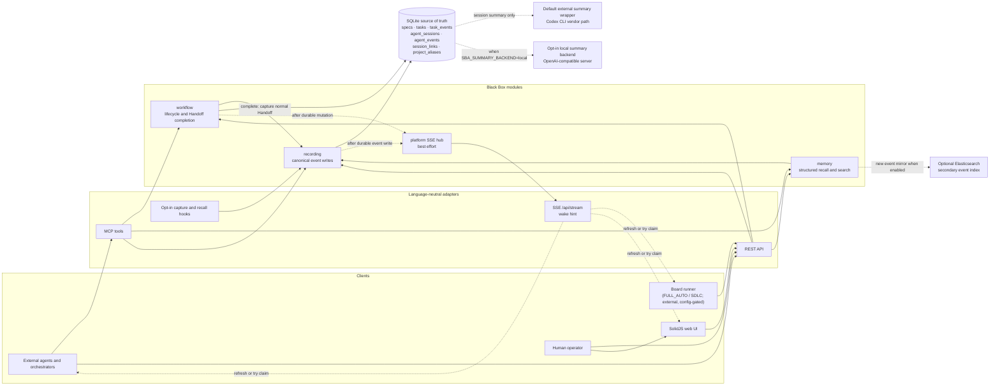
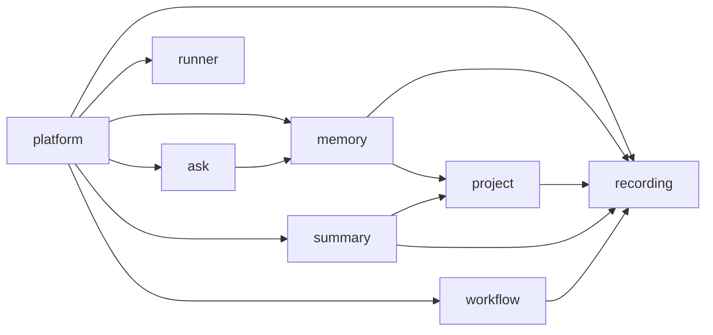
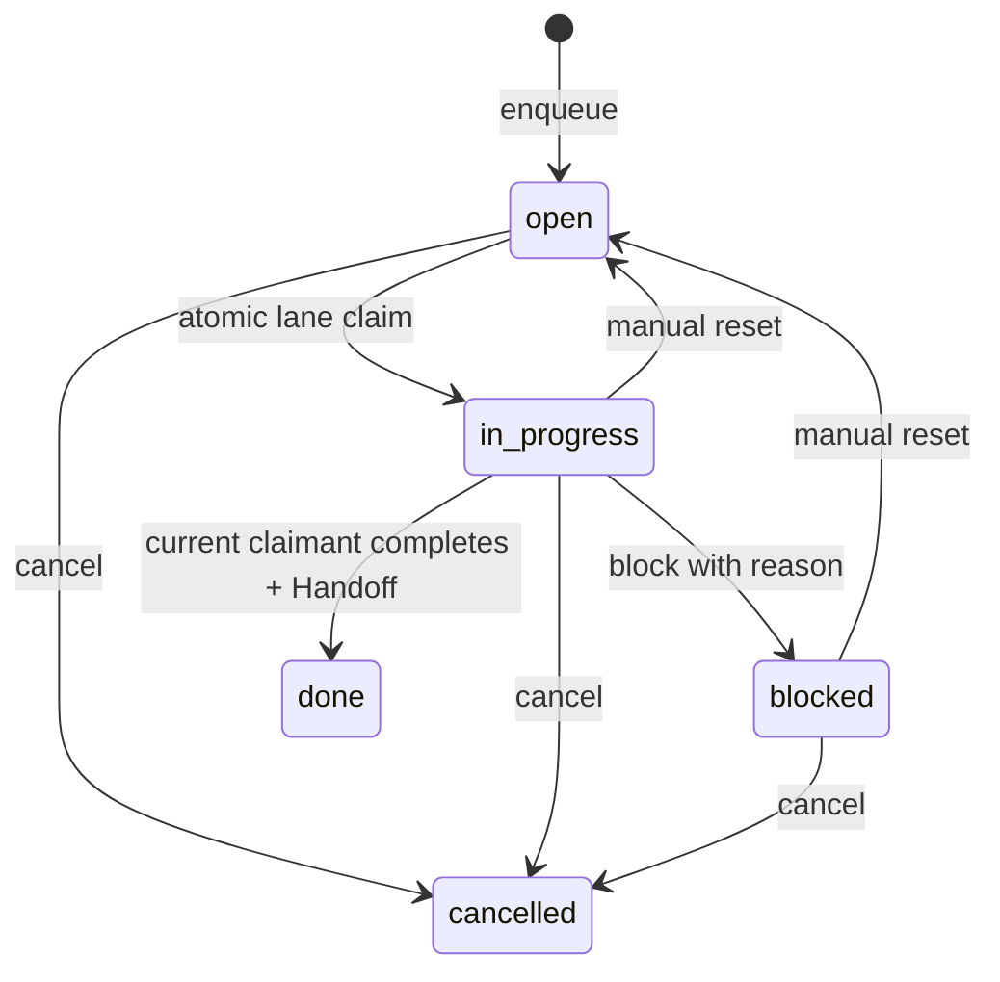

# Architecture

The Java codebase follows the feature-first modular-monolith rules in
[`docs/architecture/package-conventions.md`](architecture/package-conventions.md). Those rules make
feature ownership, internal layering, and permitted cross-feature dependencies executable in the
build while the wire and SQLite contracts described here remain stable.

Black Box is a local-first memory and coordination substrate for coding agents. It owns two related
loops:

- **continuity:** commit a structured decision, observation, or Handoff, then recall it later; and
- **coordination:** create a frozen spec, enqueue lane-routed work, atomically claim it, record its
  lifecycle, complete it with a normal Handoff, then recall that result.

The task-coordination path never launches worker agents, executes task commands, edits a checkout,
or acknowledges work on an agent's behalf. Workers and orchestrators remain external clients. The
core loops require only the Spring Boot process and SQLite; SSE is a best-effort wake hint, not a
queue or durability boundary. Configured session summarization is a separate explicit path and may
invoke a Codex or Claude CLI command through `/bin/sh -c`, with the transcript privacy boundary
described below.

## System shape

The operator launches the runner as a separate process with
`java -jar sba-agentic.jar runner`. It is gated by an explicit machine-local config selected through
`SBA_RUNNER_CONFIG` or, by default, `~/.blackbox/runner.json`, which is never committed. Like every
other client, the runner has no direct database access and uses only the REST surface described
below.

SQLite remains authoritative if an SSE client disconnects, a broadcast fails, Elasticsearch is
offline, or a model backend is unavailable. Task row mutation and its `task_events` append commit in
one SQLite transaction. The corresponding `task.*` frame is published afterward and may be missed;
clients recover by fetching `GET /api/tasks`.

## Java module graph

The application is one deployable Spring Boot jar with eight Spring Modulith modules. Each feature
owns its REST and MCP adapters, application services, domain rules, and outbound adapters beneath
its module root. `platform` is the composition edge for bootstrap, CLI dispatch, generic web errors,
SPA routing, SSE transport, configuration registration, and aggregation of feature-owned MCP tool
callbacks. `runner` is packaged with the application but behaves as an external REST client and
does not import server implementation types.

Arrows point from a consumer to the public API it imports. No module may import another module's
`internal` package. Recording is the canonical session/event boundary; optional projections and
reactions happen after its SQLite write. The stable package rules and contributor guidance live in
[`docs/architecture/package-conventions.md`](architecture/package-conventions.md).

## The coordination loop

1. `createSpec` stores a project key, title, full frozen body, optional provenance object, and actor.
   The body is the language-neutral work definition; `specRef` is never resolved at claim time.
2. `enqueueTask` creates an `open` task under that spec with one exact lane and integer priority.
3. `claimNextTask` runs one SQLite `UPDATE … RETURNING` statement. It chooses only `open` work in
   the requested lane, ordered by priority descending and creation time ascending. Competing callers
   cannot receive the same row.
4. The worker can transition `in_progress → blocked` with a reason. A worker or human can reset
   `blocked|in_progress → open`, which clears ownership, or cancel non-terminal work.
5. `completeTask` accepts only an `in_progress` task whose `claimedBy` equals `actor`. In one
   transaction it captures a normal session-backed Handoff, transitions the task to `done`, and
   stores the Handoff event id in `resultHandoffId`. A Handoff failure rolls back completion.
6. The Board or a later agent passes `resultHandoffId` to `GET /api/recall` or `recallContext`; event
   ids are direct recall keys.

`TaskService` completion does not enqueue follow-up work automatically. The completing agent, a
human, or an external orchestrator decides whether to create another task. The optional runner may
do so after observing lifecycle or approval facts, but it remains an external client. That boundary
is what keeps the Black Box server a substrate rather than an executor.

## One contract, two adapters

Workflow-owned REST and MCP adapters delegate these seven operations to the same application
service. Success JSON uses the same field names and ISO-8601 timestamps on both surfaces.

| Operation | REST | MCP tool | Input and result |
| --- | --- | --- | --- |
| Create spec | `POST /api/specs` | `createSpec` | `projectKey`, `title`, frozen `body`, optional `specRef`, `actor` → spec |
| Enqueue task | `POST /api/tasks` | `enqueueTask` | `specId`, `title`, exact `lane`, `priority`, `actor` → task/spec snapshot plus lifecycle event |
| Claim next | `POST /api/tasks/claim` | `claimNextTask` | `lane`, `agent` → claimed snapshot/event; REST `204` and MCP `null` when none is eligible |
| Update status | `PATCH /api/tasks/{taskId}` | `updateTaskStatus` | `taskId`, `actor`, `status`, optional `blockedReason` → changed snapshot/event |
| Complete | `POST /api/tasks/{taskId}/complete` | `completeTask` | `taskId`, claimant `actor`, `source`, `clientSessionId`, `summary`, `openLoops`, `nextAction` → done snapshot/event with `resultHandoffId` |
| List tasks | `GET /api/tasks` | `listTasks` | optional exact `projectKey`, `lane`, `status`, bounded `limit` → task/spec snapshots |
| Get spec | `GET /api/specs/{specId}` | `getSpec` | `specId` → full frozen spec |

List limits default to 100 and clamp to 1–250. REST task errors have
`{error: {status, type, message}}`. MCP task errors are marked as errors and include a parseable
`error` object with stable lowercase `type`, uppercase `code`, message, and task/current/target
status fields when relevant. The domain types are `VALIDATION_FAILED`, `SPEC_NOT_FOUND`,
`TASK_NOT_FOUND`, `INVALID_TRANSITION`, `CLAIMANT_MISMATCH`, `CONCURRENT_MODIFICATION`, and
`HANDOFF_FAILED`.

The following runner-supporting operations are REST-only in v1; they do not have MCP parity.

| Operation | REST | Input, storage, and result |
| --- | --- | --- |
| Append annotation | `POST /api/tasks/{taskId}/annotations` | `actor`, `kind` (`note`, `steer`, `progress`, `worker_session`, `engine`, `plan`, `review`, or `approval`), `text`, optional `dataJson` → append-only `task_events` row of type `task.note`, valid at any task status; `plan` and `review` carry stage text, while `approval` uses `{decision, stage, feedback}` data; broadcasts `task.note` with `{task, annotation, observedAt}` |
| Read task timeline | `GET /api/tasks/{taskId}/events` | Full chronological lifecycle-plus-annotation timeline rendered by Board card detail |
| Create or read session lineage | `POST /api/session-links`; `GET /api/sessions/{id}/links` | `session_links` stores `parent_session_id`, `child_session_id`, `link_type`, optional `task_id`, unique per parent/child/type triple; link types are `spawned` (runner to worker), `steered`, and `continued` |
| Read lineage DAG | `GET /api/tasks/{taskId}/dag`; `GET /api/dag?sessionId=` | Pure projection over existing specs, tasks, and sessions: spec-to-task edges from the queue, task-to-session edges from `worker_session` annotations, and session-to-session edges from `session_links`; creates no new state |

## Lifecycle and ownership

The enum retains `claimed` as a reserved value, but the MVP claim moves directly from `open` to
`in_progress`. `done` and `cancelled` are terminal. Only completion enforces claimant ownership in
the MVP; status updates still validate their allowed source state. Optimistic status predicates turn
a race into `concurrent_modification` instead of silently overwriting a newer transition.

Task lifecycle facts live in `task_events`, not `agent_events`. Ordinary queue mutations therefore
do not manufacture agent sessions. Completion is different by design: its Handoff is a normal
`agent_events` row attached to the real `source` and `clientSessionId`, which makes the result
available to existing recall without adding a second continuity system.

## SSE and the Board

`GET /api/stream` carries the existing `event.appended` and `session.updated` frames plus
`task.created`, `task.claimed`, `task.blocked`, `task.completed`, `task.reset`, `task.cancelled`, and
`task.note`. Lifecycle task frames contain the current task plus a transition id, transition type,
and timestamp; `task.note` contains `{task, annotation, observedAt}`. The annotation frame is
additive and does not change any existing frame's payload shape. Task frames deliberately omit the
frozen spec body.

The frontend task store loads authoritative task/spec snapshots over REST, applies newer lifecycle
frames idempotently, ignores duplicate or older transitions, and performs a bounded refresh after a
connection gap or malformed task frame. An SSE publish failure never rolls back a committed task.

The Board route is `/board`. It has Open, In Progress, Blocked, and Done columns, with cancelled work
in a disclosure below the main board. The URL query parameters `project`, `lane`, and `task` preserve
filters and selected detail. Task detail shows ownership, blocker, timestamps, the frozen spec,
optional provenance, the annotation timeline, and a recall-resolved completion Handoff. The Board
can create a story, post steering annotations while runner work is in progress, and post approval or
rejection annotations for completed SDLC plan and review stages. “Reset to open” remains available
for `blocked` or `in_progress` work. Each write waits for the server response instead of inventing
local state.

## Optional FULL_AUTO runner

The FULL_AUTO runner turns an explicitly submitted story into an end-to-end run while remaining an
external REST client of Black Box:

1. **Intake.** The Board's New Story form, or `createSpec` followed by `enqueueTask`, freezes the
   story and creates a task in lane `gate`.
2. **Gate.** The runner evaluates deterministic readiness checks: the repo must exist, be a readable
   Git working tree, and appear in the runner config allowlist; the Acceptance criteria section must
   be non-empty; a verify command must be present or derivable from the repo; and push intent is
   honored only when that repo's config permits it and carries no danger flag. An optional LLM pass
   can add advisory feedback but cannot solely block the story. A pass enqueues an `auto`-lane task
   and completes the gate task with a Handoff; a failure blocks the gate task with concrete repair
   guidance.
3. **Execution.** For the claimed `auto` task, the runner creates an isolated worktree and branch,
   opens a tmux session, launches the configured engine, and appends `progress` annotations at
   milestones.
4. **Completion signal.** The worker reports deterministically with
   `scripts/runner/report.sh <taskId> done|blocked "
"`. A bounded pane-state, commit-probe,
   and timeout fallback records diagnostic evidence but never infers success; an exhausted timeout
   blocks the task and preserves the worktree for inspection.
5. **Ship.** The runner, never the worker, owns push, pull-request creation, and merge through
   `scripts/runner/ship.sh`. Push and merge require the repo's `push` and `auto_merge` settings,
   respectively, and no danger flag; merge also requires green checks. A config or credential gap
   records the exact manual follow-up commands and still completes already delivered local or PR
   work. A red check gets one bounded repair round in the same worker session and blocks if it
   remains red.
6. **Complete.** `completeTask` records the usual recallable Handoff with the summary, branch, pull
   request, merge state, open loops, and next action.

On daemon restart, crash recovery resets runner-owned tasks whose tmux session is gone. A surviving
session is adopted only when its deterministic worktree still exists beneath a currently configured
repo: the runner registers it for steering, resumes completion polling on the worker pool from the
task's claim/update time, and applies an already-posted or later `done`/`blocked` report. If the
adopted session ends without a report, or its worktree cannot be found safely, the task returns to
`open` with a recovery annotation.

Fail-closed behavior is the invariant: an unknown repo, a danger flag, a red check, or a missing
credential degrades the run to local-only or blocked state, never to a risky action.

The full contract, including worker-session ingest, steering, recovery, and v1 non-goals, is in the
[`FULL_AUTO board-driven runner` design spec](superpowers/specs/2026-07-15-full-auto-board-runner.md).

## Optional SDLC runner mode

SDLC reuses the same external runner and storage contracts while inserting explicit human gates
after planning and review:

1. **Intake and gate.** The frozen story records `mode: sdlc` and begins in lane `gate`. The same
   deterministic readiness checks apply, but a pass enqueues `sdlc:plan` instead of `auto`.
2. **Plan.** A plan-stage worker receives a read-only, no-commit goal, explores the repo, posts a
   full `plan` annotation, and completes the stage task with a Handoff. The `done` task then waits for
   a human decision on its Board card.
3. **Plan decision.** An `approval` annotation with `stage: plan` and `decision: approve` allows the
   runner to enqueue the `auto` build task. A rejection records its feedback once as an SDLC
   `rejection_recorded` `progress` marker on the already-`done` plan task and enqueues nothing.
4. **Build.** The `auto` task follows the FULL_AUTO execution path through a verified commit, but it
   does not ship. The runner records the branch and worktree, preserves both, completes the build
   with a Handoff, and enqueues `sdlc:review`.
5. **Review.** A review-stage worker uses the preserved worktree under a read-only, no-code-change
   goal, checks the diff, acceptance criteria, approved plan, and verification command, posts an
   advisory `review` annotation, and completes the stage with a Handoff.
6. **Review decision and ship.** Approval invokes the existing shipping executor directly against
   the preserved worktree. Repo allowlists, danger settings, push and auto-merge configuration,
   credentials, and green-check requirements remain unchanged and fail closed. Rejection records the
   same durable marker, ships nothing, and preserves the worktree for inspection.

“Awaiting approval” is a Board state, not a task lifecycle status: the plan or review task remains
`done`, and without a matching approval the runner makes no progress. Approval annotations are
append-only REST/UI facts; the server stores and broadcasts them but never consumes them or launches
work. The runner treats an approval SSE frame only as a wake hint, reconciles completed SDLC stages
at startup and every 60 seconds, and uses existing successor tasks plus SDLC progress markers to make
replays idempotent. SQLite remains authoritative throughout.

The complete stage contracts, approval payloads, reconciliation rules, and non-goals are in the
[`SDLC mode` design spec](superpowers/specs/2026-07-16-sdlc-mode.md).

## Logical project identity

Projects remain a read model over normalized recorded working directories. `project_aliases` adds
cycle-safe, reversible mappings between an observed scope and its owning project. Automatic rows
retain their direct structural owner while reads resolve the chain to one primary canonical scope.
Git-common-directory worktrees and structurally unambiguous `.claude/worktrees` / `.worktrees`
paths whose owner has Git metadata can be discovered automatically; basename-only matches,
unverified paths, system contexts, `/`, and `__no_project__` are never merged automatically.

Project summaries aggregate session/event/meld counts and expose every constituent scope. Project
session, Hybrid Storyline, and saved-meld reads resolve through the same identity, and old encoded
worktree URLs continue to resolve to the primary project. The hidden `project_group:` Activity facet
uses this grouped identity, while `project_exact:` remains a raw exact-path filter.

Grouping never rewrites `agent_sessions.cwd`, raw events, task/spec project keys, or historical meld
rows. `/api/tasks?projectKey=` also remains exact: the Board may display a logical project name, but
selecting a project never infers work or broadens the authoritative queue query.

## Continuity and search components

- **Recording.** Normalizes hook/API event payloads and persists sessions plus structured events in
  SQLite behind recording-owned store ports.
- **Memory.** Captures and recalls decisions, Handoffs, and observations by repo, topic, or direct
  event id; searches SQLite events and optionally combines Elasticsearch hits.
- **Project.** Resolves conservative logical project identity, derives grouped project views, and
  builds bounded meld artifacts from recorded sessions.
- **Summary.** Owns session finalization, local/external summary providers, and transcript exports.
- **Ask.** Owns retrieval orchestration, query embedding, and grounded answer synthesis.
- **Workflow.** Owns specs, tasks, annotations, lifecycle, session lineage, and DAG projection.
- **SolidJS web UI.** Reads the same REST surfaces for Activity, Board, Recall, search, and supporting
  views, including the read-oriented Projects workspace and its explicit identity-curation controls;
  Vite assets are packaged into the Spring Boot
  jar by the `frontend` Maven profile.

## Local-first and model boundaries

SQLite is the only canonical store. Elasticsearch is disabled by default and is only a secondary
index for new events; it is not used by atomic claims or the Board.

Session summarization has a separate privacy and process boundary. The `external` backend passes
the configured `SBA_SUMMARY_EXTERNAL_COMMAND` to `/bin/sh -c`; the default command is the bundled
Codex CLI wrapper, and the bundled Claude wrapper is an optional alternative. Transcript text can
therefore leave the machine for the selected vendor. Set `SBA_SUMMARY_BACKEND=local` to explicitly
choose LM Studio or another OpenAI-compatible local server; local failures degrade to compacted
transcript output. Neither summary path launches workers, executes queued task commands, or
participates in task coordination or structured recall.

## MVP non-goals

The Black Box server intentionally embeds no worker runner and adds no worker-process spawning,
task-command execution, checkout mutation, lease, heartbeat, automatic reaper, dependency-aware
scheduling DAG, capability registry, multi-node broker, authentication layer, priority aging, or
server-side automatic follow-up enqueue. Manual reset is the recovery mechanism for abandoned
ownership. Those additions must preserve SQLite as the truth and keep task execution outside the
Black Box server. The separately configured session-summary subprocess described above is not a
worker or task executor.

The external, config-gated FULL_AUTO and SDLC runner modes documented above do not change that
boundary. They run in a separate operator-launched process that is an ordinary client of the same
REST surface used by other agents and orchestrators; the server itself still spawns no workers,
executes no task commands, and mutates no checkout.

The implemented design and file map are recorded in
[`docs/superpowers/specs/2026-06-28-agent-task-queue-design.md`](superpowers/specs/2026-06-28-agent-task-queue-design.md)
and its [implementation plan](superpowers/plans/2026-07-10-agent-task-queue-implementation.md).
