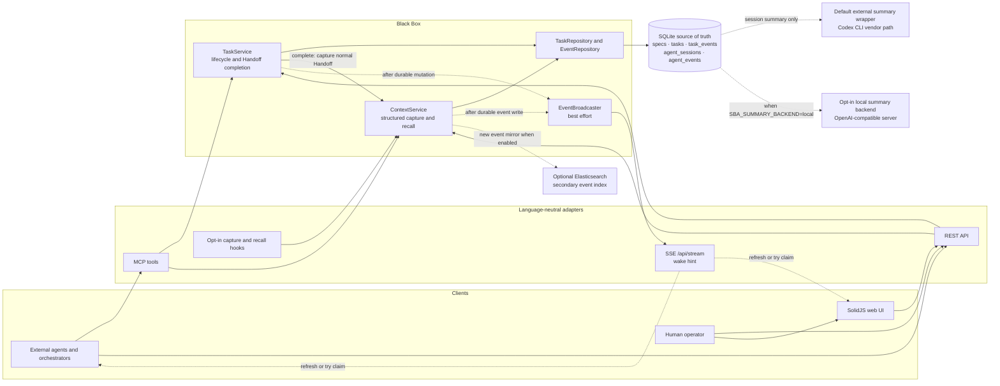
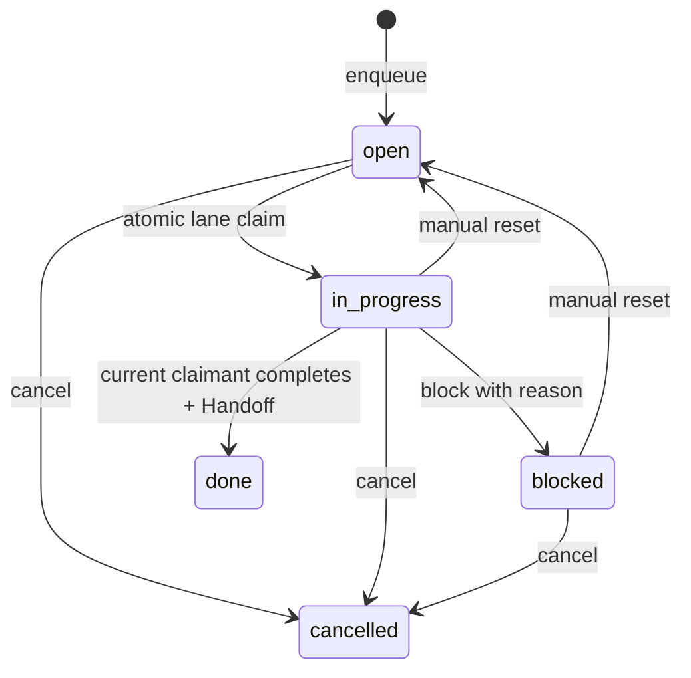

# Architecture

Black Box is a local-first memory and coordination substrate for coding agents. It owns two related
loops:

- **continuity:** commit a structured decision, observation, or Handoff, then recall it later; and
- **coordination:** create a frozen spec, enqueue lane-routed work, atomically claim it, record its
  lifecycle, complete it with a normal Handoff, then recall that result.

The server never launches agents, runs commands, edits a checkout, or acknowledges work on an
agent's behalf. Workers and orchestrators remain external clients. The core loops require only the
Spring Boot process and SQLite; SSE is a best-effort wake hint, not a queue or durability boundary.

## System shape

SQLite remains authoritative if an SSE client disconnects, a broadcast fails, Elasticsearch is
offline, or a model backend is unavailable. Task row mutation and its `task_events` append commit in
one SQLite transaction. The corresponding `task.*` frame is published afterward and may be missed;
clients recover by fetching `GET /api/tasks`.

## The coordination loop

1. `createSpec` stores a project key, title, full frozen body, optional provenance object, and actor.
   The body is the language-neutral work definition; `specRef` is never resolved at claim time.
2. `enqueueTask` creates an `open` task under that spec with one exact lane and integer priority.
3. `claimNextTask` runs one SQLite `UPDATE … RETURNING` statement. It chooses only `open` work in
   the requested lane, ordered by priority descending and creation time ascending. Competing callers
   cannot receive the same row.
4. The worker can transition `in_progress → blocked` with a reason. A worker or human can reset
   `blocked|in_progress → open`, which clears ownership, or cancel non-terminal work.
5. `completeTask` accepts only an `in_progress` task whose `claimedBy` equals `actor`. In one
   transaction it captures a normal session-backed Handoff, transitions the task to `done`, and
   stores the Handoff event id in `resultHandoffId`. A Handoff failure rolls back completion.
6. The Board or a later agent passes `resultHandoffId` to `GET /api/recall` or `recallContext`; event
   ids are direct recall keys.

Completion does not enqueue follow-up work automatically. The completing agent, a human, or an
external orchestrator decides whether to create another task. That boundary is what keeps Black Box
a substrate rather than an executor.

## One contract, two adapters

`AgenticController` and `AgenticTools` delegate these seven operations to the same `TaskService`.
Success JSON uses the same field names and ISO-8601 timestamps on both surfaces.

| Operation | REST | MCP tool | Input and result |
| --- | --- | --- | --- |
| Create spec | `POST /api/specs` | `createSpec` | `projectKey`, `title`, frozen `body`, optional `specRef`, `actor` → spec |
| Enqueue task | `POST /api/tasks` | `enqueueTask` | `specId`, `title`, exact `lane`, `priority`, `actor` → task/spec snapshot plus lifecycle event |
| Claim next | `POST /api/tasks/claim` | `claimNextTask` | `lane`, `agent` → claimed snapshot/event; REST `204` and MCP `null` when none is eligible |
| Update status | `PATCH /api/tasks/{taskId}` | `updateTaskStatus` | `taskId`, `actor`, `status`, optional `blockedReason` → changed snapshot/event |
| Complete | `POST /api/tasks/{taskId}/complete` | `completeTask` | `taskId`, claimant `actor`, `source`, `clientSessionId`, `summary`, `openLoops`, `nextAction` → done snapshot/event with `resultHandoffId` |
| List tasks | `GET /api/tasks` | `listTasks` | optional exact `projectKey`, `lane`, `status`, bounded `limit` → task/spec snapshots |
| Get spec | `GET /api/specs/{specId}` | `getSpec` | `specId` → full frozen spec |

List limits default to 100 and clamp to 1–250. REST task errors have
`{error: {status, type, message}}`. MCP task errors are marked as errors and include a parseable
`error` object with stable lowercase `type`, uppercase `code`, message, and task/current/target
status fields when relevant. The domain types are `VALIDATION_FAILED`, `SPEC_NOT_FOUND`,
`TASK_NOT_FOUND`, `INVALID_TRANSITION`, `CLAIMANT_MISMATCH`, `CONCURRENT_MODIFICATION`, and
`HANDOFF_FAILED`.

## Lifecycle and ownership

The enum retains `claimed` as a reserved value, but the MVP claim moves directly from `open` to
`in_progress`. `done` and `cancelled` are terminal. Only completion enforces claimant ownership in
the MVP; status updates still validate their allowed source state. Optimistic status predicates turn
a race into `concurrent_modification` instead of silently overwriting a newer transition.

Task lifecycle facts live in `task_events`, not `agent_events`. Ordinary queue mutations therefore
do not manufacture agent sessions. Completion is different by design: its Handoff is a normal
`agent_events` row attached to the real `source` and `clientSessionId`, which makes the result
available to existing recall without adding a second continuity system.

## SSE and the Board

`GET /api/stream` carries the existing `event.appended` and `session.updated` frames plus
`task.created`, `task.claimed`, `task.blocked`, `task.completed`, `task.reset`, and
`task.cancelled`. Task frames contain the current task plus a transition id, transition type, and
timestamp. They deliberately omit the frozen spec body.

The frontend task store loads authoritative task/spec snapshots over REST, applies newer lifecycle
frames idempotently, ignores duplicate or older transitions, and performs a bounded refresh after a
connection gap or malformed task frame. An SSE publish failure never rolls back a committed task.

The Board route is `/board`. It has Open, In Progress, Blocked, and Done columns, with cancelled work
in a disclosure below the main board. The URL query parameters `project`, `lane`, and `task` preserve
filters and selected detail. Task detail shows ownership, blocker, timestamps, the frozen spec and
optional provenance, and a recall-resolved completion Handoff. Its only write control is “Reset to
open” for `blocked` or `in_progress` work; the Board waits for the server response and refreshes
instead of inventing local state.

## Continuity and search components

- **`EventIngestService` and `EventRepository`.** Normalize hook/API event payloads and persist
  sessions plus structured events in SQLite.
- **`ContextService`.** Capture and recall decisions, Handoffs, and observations by repo, topic, or
  direct event id.
- **`SearchService`.** Search SQLite events and optionally combine Elasticsearch hits.
- **`ProjectService` and `ProjectMeldService`.** Derive project views and bounded meld artifacts from
  recorded sessions.
- **SolidJS web UI.** Reads the same REST surfaces for Activity, Board, Recall, search, and supporting
  views; Vite assets are packaged into the Spring Boot jar by the `frontend` Maven profile.

## Local-first and model boundaries

SQLite is the only canonical store. Elasticsearch is disabled by default and is only a secondary
index for new events; it is not used by atomic claims or the Board.

Session summarization has a separate privacy boundary. The default `external` backend invokes the
bundled Codex CLI wrapper, so transcript text can leave the machine for that vendor. Set
`SBA_SUMMARY_BACKEND=local` to explicitly choose LM Studio or another OpenAI-compatible local
server; local failures degrade to compacted transcript output. These summary paths are not involved
in task coordination or structured recall.

## MVP non-goals

The shipped coordination MVP intentionally has no embedded agent runner, process spawning, command
execution, file mutation, lease, heartbeat, automatic reaper, dependency DAG, capability registry,
multi-node broker, authentication layer, priority aging, or automatic follow-up enqueue. Manual
reset is the recovery mechanism for abandoned ownership. Those additions must preserve SQLite as
the truth and keep execution outside the Black Box server.

The implemented design and file map are recorded in
[`docs/superpowers/specs/2026-06-28-agent-task-queue-design.md`](superpowers/specs/2026-06-28-agent-task-queue-design.md)
and its [implementation plan](superpowers/plans/2026-07-10-agent-task-queue-implementation.md).
