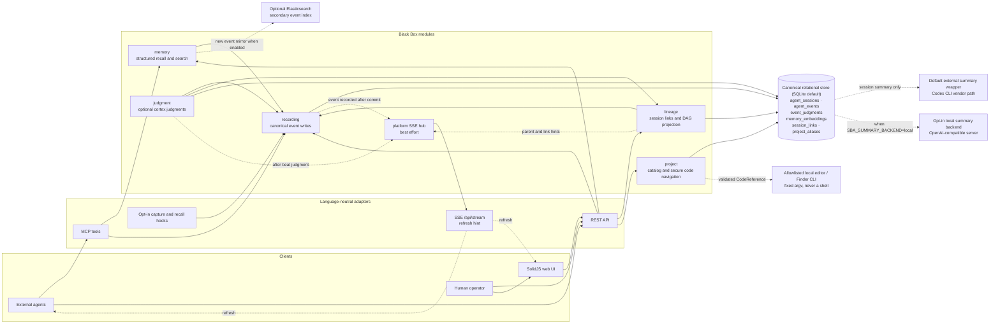
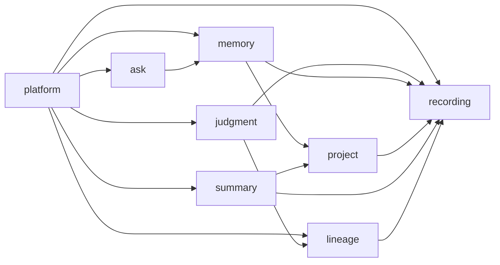

# Architecture

The Java codebase follows the feature-first modular-monolith rules in
[`docs/architecture/package-conventions.md`](architecture/package-conventions.md). Those rules make
feature ownership, internal layering, and permitted cross-feature dependencies executable in the
build while the wire and SQLite contracts described here remain stable.

Black Box is a local-first memory bus for coding agents. Its core loop is to capture structured
intent, preserve session relationships, and recall that evidence later. Black Box no longer owns a
task queue or worker runner; track work in whatever tool you already use (the maintainer uses
Linear).

The core loop requires only the Spring Boot process and SQLite. SSE is not a durability boundary:
`event.appended` frames carry a durable, replayable append cursor, while `session.updated` and
`judgment.appended` are transient hints (see [SSE and lineage hints](#sse-and-lineage-hints)).
Session summarization runs after canonical capture, in the background. A terminal capture
(`SessionEnd`, `Stop`, or `SubagentStop`) automatically schedules a summary for a session that has
none, and the `summarize` commands run it explicitly. With the default `external` backend that
invokes a Codex CLI wrapper through `/bin/sh -c`, so transcript text can leave the machine; see the
privacy boundary below.

## System shape

```mermaid
flowchart LR
    subgraph Clients["Clients"]
        AGENTS["External agents"]
        HUMAN["Human operator"]
        UI["SolidJS web UI"]
    end

    subgraph Adapters["Language-neutral adapters"]
        MCP["MCP tools"]
        REST["REST API"]
        HOOK["Opt-in capture and recall hooks"]
        STREAM["SSE /api/stream<br/>refresh hint"]
    end

    subgraph Core["Black Box modules"]
        LINEAGE["lineage<br/>session links and DAG projection"]
        MEMORY["memory<br/>structured recall and search"]
        JUDGMENT["judgment<br/>optional cortex judgments"]
        RECORDING["recording<br/>canonical event writes"]
        PROJECT["project<br/>catalog and secure code navigation"]
        BROADCAST["platform SSE hub<br/>best effort"]
    end

    DB[("Canonical relational store (SQLite default)<br/>agent_sessions · agent_events<br/>event_judgments<br/>memory_embeddings<br/>session_links · project_aliases")]
    ES["Optional Elasticsearch<br/>secondary event index"]
    EXTERNAL["Default external summary wrapper<br/>Codex CLI vendor path"]
    LOCAL["Opt-in local summary backend<br/>OpenAI-compatible server"]
    EDITOR["Allowlisted local editor / Finder CLI<br/>fixed argv, never a shell"]

    AGENTS --> MCP & REST
    HUMAN --> REST & UI
    UI --> REST
    HOOK --> RECORDING
    MCP --> MEMORY & RECORDING
    REST --> LINEAGE & MEMORY & RECORDING & PROJECT
    LINEAGE --> RECORDING
    MEMORY --> RECORDING
    JUDGMENT --> RECORDING & LINEAGE
    PROJECT --> DB
    PROJECT -. "validated CodeReference" .-> EDITOR
    RECORDING --> DB
    JUDGMENT --> DB
    LINEAGE --> DB
    RECORDING -. "event recorded after commit" .-> BROADCAST
    LINEAGE -. "parent and link hints" .-> BROADCAST
    JUDGMENT -. "after beat judgment" .-> BROADCAST
    BROADCAST --> STREAM
    STREAM -. "refresh" .-> AGENTS & UI
    MEMORY -. "new event mirror when enabled" .-> ES
    DB -. "session summary only" .-> EXTERNAL
    DB -. "when SBA_SUMMARY_BACKEND=local" .-> LOCAL
```

The selected relational database remains authoritative if an SSE client disconnects, a broadcast
fails, Elasticsearch is offline, or a model backend is unavailable. Optional indexes and stream
updates do not replace stored events or links.

## Java module graph

The application is one deployable Spring Boot jar. Each feature
owns its REST and MCP adapters, application services, domain rules, and outbound adapters beneath
its module root. `platform` is the composition edge for bootstrap, CLI dispatch, generic web errors,
SPA routing, SSE transport, configuration registration, and aggregation of feature-owned MCP tool
callbacks. Session lineage has its own module and no task-board dependency.

```mermaid
flowchart LR
    PLATFORM["platform"] --> ASK["ask"]
    PLATFORM --> JUDGMENT["judgment"]
    PLATFORM --> MEMORY["memory"]
    PLATFORM --> RECORDING["recording"]
    PLATFORM --> SUMMARY["summary"]
    PLATFORM --> LINEAGE["lineage"]
    ASK --> MEMORY
    JUDGMENT --> RECORDING
    JUDGMENT --> LINEAGE
    MEMORY --> PROJECT["project"]
    MEMORY --> RECORDING
    PROJECT --> RECORDING
    SUMMARY --> PROJECT
    SUMMARY --> RECORDING
    LINEAGE --> RECORDING
```

Arrows point from a consumer to the public API it imports. No module may import another module's
`internal` package. Recording is the canonical session/event boundary. Capture publishes
`EventRecorded` after its persistence transaction commits. The lineage listener reacts through that
public event API, before the platform broadcaster enriches `session.updated` with link hints.
Recording never imports lineage. SSE is a hint and Elasticsearch is rebuildable; neither is
canonical evidence. See `EventIngestService.ingest`, `SubagentLinkListener`, and `EventBroadcaster`.
The stable package rules and contributor guidance live in
[`docs/architecture/package-conventions.md`](architecture/package-conventions.md).

The optional `judgment` module owns the cortex stage described in [`docs/cortex.md`](cortex.md):
folding events into beats, asking the shared `orbit-jev-v1` question set when enabled, persisting
typed answers, and publishing `judgment.appended` as an advisory stream update.

The `project` module also owns local file navigation. `GET /api/projects/code-scopes` projects only
session-backed catalog scopes that exist beneath a filesystem-verified Git root. The UI derives an
opaque-key plus relative-path `CodeReference`; `POST /api/open-in-editor` and
`POST /api/reveal-in-finder` re-resolve it against the exact current scope, reject lexical or
symlink escape, and require a readable regular file. The module's outbound process adapter accepts
only fixed command shapes and an allowlisted absolute Cursor/VS Code-compatible executable (or
fixed `/usr/bin/open -R` for Finder), passed to `ProcessBuilder` as discrete argv. This path never
uses the shell-based summary adapter.

## Session lineage

The `lineage` module owns `session_links`, hook-derived subagent relationships, child counts, and
the session-only DAG projection. It depends on the public recording API, and is consumed by the
judgment module and the platform SSE broadcaster. It has no task-board or runner dependency.

| Operation | REST | Contract |
| --- | --- | --- |
| Create session link | `POST /api/session-links` | Parent session, child session, and one of `spawned`, `steered`, or `continued`; each parent/child/type triple is unique |
| Read session links | `GET /api/sessions/{id}/links` | Parent and child links for the selected session |
| Read child counts | `GET /api/session-links/child-counts?ids=...` | Counts keyed by parent session ID |
| Read session DAG | `GET /api/dag?sessionId=...` | Read-only projection of the selected session and directly linked parents and children |

Browse retains nested child sessions, parent/child navigation, link badges, and the session DAG.
The hook bridge continues deriving Claude subagent session identities from the parent session ID
and agent ID. `SubagentLinkListener` turns recorded subagent events into `spawned` links; the
recording module remains independent of lineage.

The board retirement (internal tracker issue NAT-243) removed task/spec REST endpoints, workflow MCP tools, task-specific DAG reads, and the
runner. Historical Handoff events remain ordinary recallable captures. See
[retirement and upgrade notes](board-retirement.md) for schema and client migration boundaries.

## SSE and lineage hints

`GET /api/stream` retains `event.appended` and `session.updated`; the cortex stage adds
`judgment.appended` when `sba.judge.enabled=true`. `event.appended` includes `role`, `textPreview`,
and `parentSessionId`; `session.updated` includes `spawnedBy` and `linkTypes`. The lineage module
continues supplying those hints to the broadcaster and Orbit continues using the same session
relationships.

`event.appended` frames are delivered in database append order with an opaque, versioned cursor.
A client that reconnects with `Last-Event-ID` replays missed captures in pages of up to 2,000
positions; an unknown, legacy (`<observedAt>|<id>`), or other-database cursor produces
`replay.reset`, and the client must reload canonical REST state. `since=<ISO-8601>` is an optional
observed-time filter, not a cursor. `session.updated` and `judgment.appended` remain transient,
best-effort hints with no replay. The retired `task.*` lifecycle and annotation frames are no longer
emitted. The full contract is in [durable stream recovery](durable-stream-recovery.md).

## Logical project identity

Projects remain a read model over normalized recorded working directories. `project_aliases` adds
cycle-safe, reversible mappings between an observed scope and its owning project. Automatic rows
retain their direct structural owner while reads resolve the chain to one primary canonical scope.
Git-common-directory worktrees and structurally unambiguous `.claude/worktrees` / `.worktrees`
paths whose owner has Git metadata can be discovered automatically; basename-only matches,
unverified paths, system contexts, `/`, and `__no_project__` are never merged automatically.

Project summaries aggregate session/event/meld counts and expose every constituent scope. Project
session, Hybrid Storyline, and saved-meld reads resolve through the same identity, and old encoded
worktree URLs continue to resolve to the primary project. The hidden `project_group:` Activity facet
uses this grouped identity, while `project_exact:` remains a raw exact-path filter.

Grouping never rewrites `agent_sessions.cwd`, raw events, or historical meld rows. Projects
remain a continuity read model with their existing identity-curation controls.

## Continuity and search components

- **Recording.** Normalizes hook/API event payloads and persists sessions plus structured events in
  SQLite behind recording-owned store ports. Its paged session reader keeps recorded events
  canonical and can transiently fill missing user/assistant text from the session's known local
  Codex or Claude JSONL. The reader canonicalizes and confines that stored path, validates transcript
  identity, redacts returned text, and never persists the enrichment.
- **Memory.** Captures and recalls decisions, Handoffs, observations, ideas, and evidence by repo, topic, semantic
  paraphrase, or direct event id; fuses lexical SQLite recall with local vector recall when memory
  embeddings are available; searches SQLite events and optionally combines Elasticsearch hits.
  Semantic recall returns structured intent events (`Decision`, `Handoff`, `Observation`, `Idea`, `Evidence`)
  only. `GET /api/ideas` lists ideas collapsed to the latest capture per `ideaKey`.
  Non-empty session summaries are stored in the memory embedding index for backfill and future
  retrieval, but no recall path surfaces them today; the full captured event corpus is not
  semantically indexed.
  Recall item `score` is true cosine similarity or `null` when no query/vector score exists. A
  measured 0.61 relevance floor (live corpus, 2026-07-28) gates semantic-only additions;
  `sba.memory.recall.relevance-floor=0` disables it. Re-measure with the env-gated harness after
  corpus growth or embedding model changes.
- **Project.** Resolves conservative logical project identity, derives grouped project views, and
  builds bounded meld artifacts from recorded sessions.
- **Summary.** Owns session finalization, local/external summary providers, and transcript exports.
- **Ask.** Owns retrieval orchestration, query embedding, and grounded answer synthesis.
- **Lineage.** Owns session links, subagent relationships, child counts, and session DAG projection.
- **SolidJS web UI.** Reads the same REST surfaces for Activity, Recall, search, and supporting
  views, including the read-oriented Projects workspace and its explicit identity-curation controls.
  Browse pages the full selected session with tools visible by default, keeps memory events opt-in,
  and runs session-bound search over both recorded events and transcript-only conversation text.
  Recall links carry the owning session and event; Browse still uses the exact-event read when a
  target falls outside its current page. Presenter file references resolve reactively against the
  verified code-scope projection; unresolved paths remain copy-only, while open/reveal success and
  typed failures render locally. Vite assets are packaged into the Spring Boot jar by the `frontend`
  Maven profile.

## Local-first and model boundaries

SQLite is the default canonical store. The optional PostgreSQL profile owns a separate canonical
database; it does not synchronize SQLite history or provide safe multiple API replicas. See the
[PostgreSQL backend guide](postgres-backend.md). SQLite-specific tables and indexing behavior below
apply to the default backend. Elasticsearch is disabled by default and is only a secondary index
for new events.

| Table | Owner | Purpose |
| --- | --- | --- |
| `agent_sessions` | recording | Canonical agent session identity, title, working directory, summary, and activity counters |
| `agent_events` | recording | Canonical captured events, including structured Decisions, Handoffs, Observations, Projections, Ideas, and Evidence |
| `event_stream_state`, `event_stream_positions` | recording | Transactionally serialized append cursor, database generation and retained event-ID anchors for [durable SSE recovery](durable-stream-recovery.md) |
| `memory_embeddings` | memory | Canonical float32 vectors for structured intent and session summaries; sqlite-vec is only an optional accelerator rebuilt from this table |
| `session_links` | lineage | Explicit session relationships used by Browse, session DAGs, and Orbit |
| `project_aliases` | project | Reversible logical-project grouping over recorded working directories |
| `event_fts`, `search_index_state` | recording | Contentless FTS5 index over `agent_events` (text, tool_name, clipped tool JSON) plus its backfill progress row; trigger-maintained inside the canonical write transaction and fully rebuildable |

When sqlite-vec is configured and loadable, startup rebuilds its optional `memory_vec` index in a
transaction from canonical vectors matching the configured model and dimensions. This recovers
embeddings recorded before enabling the extension and interrupted index updates, without calling a
model or changing canonical bytes. Rebuild time grows with that corpus. A failed rebuild (including
an incompatible existing native-table dimension) leaves portable canonical ranking available;
queries for another model also use that path. Leaving the extension unconfigured remains the default.

The FTS index is a rebuildable secondary inside canonical SQLite: insert/delete/update triggers on
`agent_events` keep it consistent by construction, the chunked background backfill doubles as the
rebuild job, and free-text search falls back to per-term LIKE whenever FTS is unavailable.
The semantics differ: FTS5 matches token prefixes, while LIKE matches substrings; see
[PostgreSQL behavior and limits](postgres-backend.md#behavior-and-limits). **Invariant: never `VACUUM` the live database without an FTS rebuild afterwards.**
`agent_events` has a TEXT primary key, so its implicit rowids may be renumbered by VACUUM, silently
remapping every FTS hit (2026-08-20 stream spec §6.3, D8).

Session summarization has a separate privacy and process boundary. The `external` backend passes
the configured `SBA_SUMMARY_EXTERNAL_COMMAND` to `/bin/sh -c`; the default command is the bundled
Codex CLI wrapper, and the bundled Claude wrapper is an optional alternative. Transcript text can
therefore leave the machine for the selected vendor. Set `SBA_SUMMARY_BACKEND=local` to explicitly
choose LM Studio or another OpenAI-compatible server at `SBA_LOCAL_AI_BASE_URL`. That URL defaults to
loopback but is not confined to it: a remote URL receives the transcript text. Local failures, or
`SBA_LOCAL_AI_ENABLED=false`, degrade to compacted transcript output. Neither summary path launches workers or participates in structured recall.

## Product boundaries

Black Box captures and retrieves agent evidence; it does not own execution tracking, task queues,
worker scheduling, or shipping. The former board and runner are retained only as
[historical design records](history/retired-board/README.md). Local runner state is not part of the
repository retirement, and no cleanup or service change is implied by this code change.

Optional [authentication](authentication.md) is disabled by default for loopback deployments.
Any future integration must preserve the selected relational store as canonical and keep execution
authority outside this service. The separately configured session-summary subprocess described
above retains its existing privacy and process boundary.
