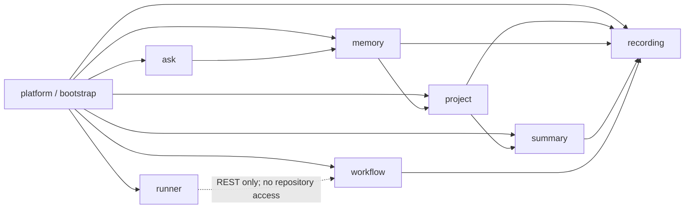

# Java modular-monolith refactor plan

Date: 2026-07-20

Status: Chosen direction; implementation not started

## Decision

Refactor Black Box into a **feature-first modular monolith**. Each product capability will own its
domain types, application services, inbound adapters, outbound adapters, and persistence code.
Complex capabilities will use ports and adapters internally; small capabilities will stay small
instead of receiving ceremonial layers.

Do not reproduce a global `controller/`, `model/`, `service/`, and `repository/` tree. That layout
looks orderly from the top but scatters every feature across the codebase and makes ownership,
dependencies, and change impact harder to see. “Models with models” will mean domain types grouped
inside the feature that owns them, while HTTP records stay beside HTTP adapters and SQLite row
projections stay beside SQLite adapters.

The quality bar is not the number of folders. It is a dependency graph that a new engineer can
understand, that the build enforces, and that cannot silently collapse back into god classes.

## Why this is the Spring-native choice

Spring Boot deliberately avoids prescribing one rigid layout, but its reference guide recommends a
root application package and points domain-oriented applications toward Spring Modulith. Spring
Modulith treats direct subpackages as application modules, makes the module root the default public
API, treats deeper packages as implementation details, and can verify module cycles and illegal
access. ArchUnit complements it with code-level rules inside a module.

For Black Box, that yields three architectural rules:

1. The first package segment answers **which capability owns this code?**
2. The rest of the path answers **what role does it play inside that capability?**
3. Cross-capability calls use a deliberately small module API or application event, never another
   capability's repository or internal service.

Spring Modulith 1.4 is the compatible line for the repository's Spring Boot 3.5.x baseline. It will
become the final whole-application verifier after the existing dependency cycles are removed.
ArchUnit will provide a ratcheting guard from the first migrated slice so the build does not need a
large permanent exception list.

Official references:

- [Spring Boot: Structuring Your Code](https://docs.spring.io/spring-boot/reference/using/structuring-your-code.html)
- [Spring Modulith: Application Modules](https://docs.spring.io/spring-modulith/reference/1.4/fundamentals.html)
- [Spring Modulith: Verifying Application Module Structure](https://docs.spring.io/spring-modulith/reference/1.4/verification.html)
- [Spring Modulith: Integration Testing Application Modules](https://docs.spring.io/spring-modulith/reference/1.4/testing.html)
- [Spring Modulith compatibility matrix](https://docs.spring.io/spring-modulith/reference/appendix.html)
- [ArchUnit user guide](https://www.archunit.org/userguide/html/000_Index.html)
- [Official Spring Modulith examples](https://github.com/spring-projects/spring-modulith/tree/main/spring-modulith-examples)

## Observed baseline

The current tree has useful feature names, but most implementation types sit directly in those
packages and nearly all top-level types are public.

| Measure | Current value |
| --- | ---: |
| Production Java files | 155 |
| Production Java lines | about 15,000 |
| Test Java files | 56 |
| Test Java lines | about 10,400 |
| First-level feature packages | 18 |
| Files directly in a first-level package | 133 of 155 (86%) |
| Public top-level production types | 154 of 155 |
| Cross-first-level-package imports | 209 |
| REST mappings in `AgenticController` | 43 |
| MCP tools in `AgenticTools` | 14 |

The most concentrated classes are:

| Class | Lines | Main concerns currently combined |
| --- | ---: | --- |
| `RunExecutor` | 1,161 | orchestration, task API, worktrees, validation, shipping, recovery |
| `EventRepository` | 681 | schema migration, writes, sessions, feed, recall, facets, stats, projections |
| `SdlcApprovalReconciler` | 668 | approvals, successors, worktree checks, shipping, reconciliation |
| `ProjectRepository` | 582 | catalog, sessions, timeline, melds, classification, JSON mapping |
| `TaskRepository` | 501 | specs, tasks, claims, transitions, annotations, events, projections |
| `AgenticController` | 488 | ten unrelated REST capabilities |
| `SbaProperties` | 454 | six unrelated configuration groups |

The dependency graph contains two strongly connected areas that package moves alone would only
hide:

- `event ↔ search ↔ ai ↔ project`
- `task ↔ stream`

`EventRepository` is the central dependency hub. It is imported by web, MCP, CLI, context,
summarization, exporting, search, link, and DAG code. `EventBroadcaster` implements the search-named
`EventIndexSink` even though broadcasting is not indexing. `TaskService` directly imports the SSE
broadcaster, while stream payloads import task models.

The runner is already a substantial subsystem: 41 production files and about 5,700 lines, roughly
38% of production Java. It is a credible future Maven-module candidate, but package boundaries and
wire independence must be proven before changing artifact topology.

## Package convention

Every real feature module follows this vocabulary:

```text
dev.nathan.sbaagentic.<module>
├── package-info.java                 # module declaration and allowed dependencies
├── <Module>Operations.java           # only when another module needs a synchronous API
├── <Module>Event.java                # only events intentionally exposed across modules
├── spi/                              # rare public extension ports, exposed as named interfaces
└── internal/
    ├── domain/                       # business state, value types, rules; framework-free
    ├── application/                  # use cases and transaction boundaries
    │   └── port/                     # private ports used only by this module
    └── adapter/
        ├── in/
        │   ├── web/                  # controllers and their request/response records
        │   ├── mcp/                  # feature MCP tools
        │   └── cli/                  # feature CLI adapter, if any
        └── out/
            ├── sqlite/               # JdbcTemplate implementations and row projections
            ├── elasticsearch/        # optional search implementation
            ├── filesystem/           # exports and file boundaries
            └── model/                # external/local model adapter when owned by this feature
```

This is a vocabulary, not a quota. A five-class feature can use `internal/` directly. A package is
created only when it separates several cohesive types or establishes an enforced boundary.

### Placement rules

- A domain type lives at `<module>.internal.domain`, next to the rules that give it meaning.
- A cross-module command, query, result, or event lives at the module root only when another module
  actually consumes it.
- An HTTP request or response record lives beside its controller. It is not a domain model.
- A JDBC row mapper or projection lives beside its SQLite adapter. It is not a domain model.
- Controllers call application use cases or the module facade, never a repository.
- Application code depends on domain types and ports, never web, MCP, CLI, JDBC, Elasticsearch,
  servlet, or filesystem implementations.
- Infrastructure implements a port owned by the consuming feature.
- Cross-module reads use a module API. Cross-module reactions prefer explicit application events.
- Module internals become package-private wherever Spring proxies and tests permit it.
- Tests mirror the production package so package-private seams do not become public for test
  convenience.
- No package named `common`, `shared`, `util`, or global `model` is created by default. A genuinely
  shared technical primitive may be extracted only after it has at least three real consumers, no
  feature vocabulary, and a named owner.

### Public means intentional

At the end of the refactor, a type at a module root is an intentional Java boundary. A public type
under `internal` may still be necessary for Spring or Java mechanics, but Spring Modulith must
prevent another module from importing it.

Black Box is currently an application, not a published Java library. Supported compatibility
surfaces are REST, MCP, SSE, CLI, Spring properties, JSON, and SQLite—not implementation FQCNs.
Transitional forwarding facades may keep moves small, but old Java package names are not a permanent
API.

## Target modules

The exact class names will emerge through extraction, but ownership is fixed as follows:

| Module | Owns | Absorbs current packages |
| --- | --- | --- |
| `recording` | canonical session/event writes, structured capture, raw feed/session access, redaction | write side of `event`, `session`, capture side of `context` |
| `project` | logical project identity, aliases, catalog, timelines, saved melds | `project` |
| `memory` | recall, context assembly, event search, facets, optional Elasticsearch projection | read side of `context`, `search`, read side of `event` |
| `summary` | session finalization, summary backends, transcript export | summary-specific `ai`, `exporting` |
| `ask` | retrieval orchestration and answer synthesis | `ask`, ask-specific model adapters |
| `workflow` | specs, tasks, annotations, task lifecycle, lineage, DAG projection | `task`, `link`, `dag` |
| `runner` | the external REST-driven FULL_AUTO/SDLC runner | `runner` |
| `platform` | application bootstrap, generic HTTP errors, SPA, SSE hub, MCP registration, health | `web` shell, `mcp` shell, `stream` shell, `config`, `cli` shell |

`platform` is the composition edge: it may depend on public module APIs or implement public module
SPIs, but feature modules must never import `platform`. Feature-specific controllers and tools stay
inside their owning module; only generic registration and transport plumbing belongs in `platform`.

The existing base package `dev.nathan.sbaagentic` and root `SbaAgenticApplication` remain unchanged.
That preserves component scanning and avoids mixing a package-brand rename with an architectural
refactor. Renaming the Java namespace to match the Black Box product name is a separate future
decision.

An illustrative end state is:

```text
dev.nathan.sbaagentic
├── SbaAgenticApplication.java
├── recording/
│   ├── RecordingOperations.java
│   ├── RecordingEvent.java
│   ├── package-info.java
│   └── internal/{domain,application,adapter}
├── project/
│   ├── ProjectCatalog.java
│   ├── package-info.java
│   └── internal/{domain,application,adapter}
├── memory/
│   ├── MemoryOperations.java
│   ├── package-info.java
│   └── internal/{domain,application,adapter}
├── summary/
│   ├── SummaryOperations.java
│   ├── package-info.java
│   └── internal/{domain,application,adapter}
├── ask/
│   ├── AskOperations.java
│   ├── package-info.java
│   └── internal/{domain,application,adapter}
├── workflow/
│   ├── WorkflowOperations.java
│   ├── WorkflowEvent.java
│   ├── spi/
│   ├── package-info.java
│   └── internal/{domain,application,adapter}
├── runner/
│   ├── package-info.java
│   └── internal/{client,domain,application,adapter}
└── platform/
    └── internal/{bootstrap,config,error,health,mcp,spa,sse}
```

The intended dependency direction is acyclic:



Where a two-way business interaction appears, replace one direction with an application event or a
query boundary. For example, recording persists an event first and then publishes `EventRecorded`
or `SessionStopped`; project discovery, Elasticsearch indexing, SSE, and summarization react without
recording importing their implementations. Optional fan-out remains unable to roll back the
canonical SQLite write.

## Compatibility and safety contract

This is a structural refactor. Unless separately specified, every phase must preserve:

- all 43 REST mappings, HTTP methods, parameter defaults, limit clamps, status codes, and JSON
  property names;
- all 14 MCP tool names, input schemas, result schemas, the `agenticToolCallbacks` qualifier,
  `RestJsonToolCallResultConverter`, and structured error envelopes;
- SSE event names and payloads, including best-effort delivery semantics;
- CLI commands and executable-jar invocation;
- every existing Spring property key and default;
- SQLite table/column names, legacy migrations, WAL initialization, and old-database readability;
- the atomic event-plus-session write and task-mutation-plus-lifecycle-event transaction;
- task completion's Handoff capture transaction and claimant rules;
- JSON enum values and runner keys such as `auto_merge` and `notify`;
- the current summary privacy boundary and fail-closed runner behavior;
- the committed frontend contract and static bundle behavior.

Package names are not persisted today: there is no Java serialization, polymorphic Jackson class
metadata, service-loader registration, script FQCN, YAML FQCN, or reflective class-name lookup.
Normal package moves are therefore safe when annotations, imports, proxy boundaries, and wire
records remain intact.

Special hazards that each migration must address explicitly:

- `ProjectKeyCodec` is package-private and shared within the current project package. Replace it
  with a deliberate `ProjectKey` value type before separating those callers.
- `ProjectAliasService.Snapshot` provides one consistent alias view to `ProjectRepository`. Preserve
  snapshot consistency rather than replacing it with repeated lookups.
- `EventRepository.ensureSchema()` and numerous runner/search/stream constructors are package-private
  test seams. Co-move their tests; do not make internals public merely to keep old test packages.
- `@PostConstruct`, `@Transactional`, and transaction-template boundaries must remain on externally
  invoked Spring beans. Do not create self-invocation that bypasses Spring proxies.
- The compatibility facade for `AgenticTools` must not cause duplicate `@Tool` registration while
  feature tool objects are introduced.

## Non-goals

- No feature behavior or UI redesign.
- No REST, MCP, SSE, CLI, JSON, configuration, or schema redesign.
- No JPA conversion; SQLite and `JdbcTemplate` remain appropriate.
- No base-package rename.
- No Java Platform Module System work.
- No immediate Maven multi-module split.
- No generic framework, abstract repository hierarchy, or interface for every class.
- No big-bang package move and no long-lived branch that is red between phases.

## Implementation plan

Each phase ends in an independently reviewable, green commit. A phase may be split further, but it
must not be combined with unrelated product work.

### Phase 0 — Freeze the contracts and record the architecture decision

Goal: make “behavior unchanged” executable before moving production types.

1. Add `docs/architecture/package-conventions.md` with the package and dependency rules from this
   plan, then update `docs/architecture.md` to link it.
2. Add a sorted REST mapping snapshot test using Spring's `RequestMappingHandlerMapping`. Store the
   expected method/path set under `src/test/resources/contracts/` and include all 43 controller
   mappings plus SSE and SPA routes where appropriate.
3. Add a per-endpoint contract matrix under `src/test/resources/contracts/` that records every
   mapping's method, path, required and optional inputs, defaults, clamps, success status, error
   status, content type, and request/response property names. Map each row to an existing
   characterization test or add the missing test. The route snapshot prevents disappearance; this
   matrix prevents a route from surviving with different binding or wire behavior.
4. Extend `TaskApiContractTest` or add a focused MCP contract test that snapshots exactly 14 tool
   names and their input schemas, along with the callback qualifier and result converter.
5. Add JSON fixtures for every distinct REST request/response record plus enum values, SSE frames,
   and runner configuration keys. Reuse a fixture where multiple endpoints intentionally share the
   same record; do not settle for one representative payload per feature.
6. Add a pre-refactor SQLite compatibility fixture covering current schema creation, legacy event
   migration, and representative task/session rows.
7. Document that implementation Java FQCNs are internal. Keep temporary forwarding facades only
   where they lower migration risk.

Verification:

```bash
mvn -q -Dtest=RestContractSnapshotTest,McpContractSnapshotTest,SqliteCompatibilityTest,AgenticControllerTest,TaskApiContractTest,SessionLinkApiContractTest,ApiExceptionHandlerTest,SpaForwardingTest,EventRepositoryMigrationTest,TaskSchemaTest test
mvn test
git diff --check
```

Commit shape: `Freeze Java Refactor Contracts`

### Phase 1 — Add an architecture ratchet

Goal: stop new violations immediately without pretending the legacy graph is already modular.

1. Add ArchUnit's JUnit 5 integration in test scope.
2. Import the Spring Modulith 1.4 BOM and add `spring-modulith-api` at compile scope. This permits
   production `package-info.java` files to use `@ApplicationModule` and `@NamedInterface` as modules
   are introduced without enabling whole-application verification prematurely.
3. Create `src/test/java/dev/nathan/sbaagentic/architecture/PackageArchitectureTest.java`.
4. Enforce these rules for each migrated module:
   - domain imports no Spring Web, Spring JDBC, servlet, Jackson wire, Elasticsearch, filesystem, or
     process APIs;
   - application imports no inbound adapter or concrete outbound adapter;
   - web/MCP/CLI adapters do not import repositories;
   - SQLite repositories live only under `..adapter.out.sqlite..`;
   - no module imports another module's `..internal..` package;
   - migrated feature slices are cycle-free.
5. Add passing global rules immediately: keep `SbaAgenticApplication` in the root package; forbid
   new top-level `controller`, `model`, `service`, `repository`, `common`, `shared`, and `util`
   packages; and forbid cross-module imports of any new `..internal..` package.
6. Keep a short explicit list of modules under full layering enforcement. Add a module to that list in the same
   commit that migrates it. Do not create hundreds of grandfathered class exceptions.
7. Defer the global Spring Modulith `ApplicationModules.verify()` assertion until the old cycles are
   gone; a permanently disabled or permanently failing verifier adds no protection.

Verification:

```bash
mvn -q -Dtest=PackageArchitectureTest test
mvn -q -DskipTests compile
git diff --check
```

Commit shape: `Add Package Architecture Ratchet`

### Phase 2 — Split the inbound god adapters without changing behavior

Goal: improve navigability and establish feature entry points before moving domain code.

1. Split `web/AgenticController.java` into feature controllers at their final
   `<module>.internal.adapter.in.web` locations, preserving all mappings exactly. These adapters may
   call legacy feature services temporarily; a module enters full architecture enforcement only
   when its vertical slice is complete:
   - `EventController` — 4 mappings;
   - `ContextController` — 3;
   - `ProjectController` — 8;
   - `SummaryController` — 5;
   - `SearchController` — 3;
   - `AskController` — 3;
   - `SystemController` — 4;
   - `TaskController` — 9;
   - `DagController` — 2;
   - `SessionLinkController` — 2.
2. Put extracted request/response records beside the controller that owns their wire contract.
3. Split the implementation behind `mcp/AgenticTools.java` into recording/memory, project/summary,
   and workflow tool groups. During the transition, register either the facade or the feature tool
   objects, never both. Preserve the exact 14 names and schemas.
4. Keep `McpToolConfiguration`'s callback qualifier, error conversion, and task-error behavior.
5. Change `SbaCli` only enough to delegate to feature-facing operations; do not alter commands or
   output in this phase.

Verification:

```bash
mvn -q -Dtest=AgenticControllerTest,AgenticControllerSummaryFailureTest,TaskApiContractTest,SessionLinkApiContractTest,ApiExceptionHandlerTest,SpaForwardingTest test
mvn test
cd frontend
npm test
npm run build
npm run e2e
git diff --check
```

The Playwright command is the repository-owned packaged-jar gate: it builds with the frontend
profile, starts Black Box on isolated port `8799` with a throwaway SQLite database, and tears down
the process and temporary files. It must not be pointed at the launchd-owned service on `8766`.

Commit shape: `Split Feature Entry Points`

### Phase 3 — Migrate workflow as the first full vertical slice

Goal: prove the convention on a transactional feature with strong REST/MCP tests and remove the
smaller `task ↔ stream` cycle.

1. Create the `workflow` module declaration, root API, and internal packages.
2. Move task domain state, validation, commands, queries, and application use cases under workflow.
3. Split `TaskRepository` behind use-case-specific ports for specs, task lifecycle, annotations, and
   projections. The SQLite adapter may initially share one internal SQL helper; callers must stop
   depending on a universal repository.
4. Introduce a workflow-owned publication SPI. Let the platform SSE adapter implement it so workflow
   no longer imports `EventBroadcaster` or `StreamEvents`.
5. Preserve transaction boundaries around task mutation plus lifecycle append and task completion
   plus Handoff capture.
6. Move `dag` and `link` into workflow in two follow-up commits, using the workflow module API rather
   than importing workflow internals.
7. Co-move task, DAG, and link tests. Keep internal constructors package-private.
8. Add workflow to the ArchUnit enforcement set.

Verification:

```bash
mvn -q -Dtest=TaskRepositoryTest,TaskSchemaTest,TaskServiceIntegrationTest,TaskApiContractTest,TaskStreamTest,DagProjectionTest,SessionLinkApiContractTest test
mvn test
mvn -q -DskipTests package
git diff --check
```

Commit sequence:

1. `Modularize Workflow Task Lifecycle`
2. `Move Session Lineage Into Workflow`
3. `Move DAG Projection Into Workflow`

### Phase 4 — Extract the recording kernel and dismantle `EventRepository`

Goal: remove the central dependency hub while preserving SQLite as the canonical write boundary.

1. Introduce recording domain types and application operations for event/session persistence.
2. Split `EventRepository` by responsibility and target ownership:
   - recording owns the canonical event/session store, raw session/feed queries, recording storage
     statistics, and the schema migrator;
   - a memory module skeleton owns recall and search-facet ports/adapters immediately, even though
     the rest of memory migrates in Phase 5;
   - project-scope expansion happens through project's public API above the SQL adapter, never by
     importing project services into recording persistence.
3. Preserve `@PostConstruct` schema migration, WAL configuration, exact SQL mappings, and the atomic
   event-plus-session write. The first extraction may delegate to one internal SQL component; the
   public universal repository must disappear before the phase closes. Temporary memory adapters
   may query recording-owned tables read-only, but they do not own schema migration or writes and
   must enter full memory enforcement in Phase 5.
4. Replace `EventIndexSink` with meaning-specific reactions. Persist first; only then perform
   project alias discovery, optional Elasticsearch indexing, best-effort SSE, and finalization.
5. Publish explicit recording events such as `EventRecorded` and `SessionStopped`. Use post-commit
   listeners only where their failure semantics match today's behavior; write tests for ordering and
   failure isolation before changing synchronous behavior.
6. Move structured capture from `context` into recording. Leave recall/context assembly for the
   memory phase.
7. Ensure recording imports neither project, search, summary/AI, nor platform internals.
8. Add recording to the ArchUnit enforcement set.

Verification:

```bash
mvn -q -Dtest=EventIngestServiceTest,EventRepositoryMigrationTest,EventFeedTest,EventSearchFacetTest,ContextLoopTest,EventStreamTest,SessionTitleTest test
mvn test
mvn -q -DskipTests package
git diff --check
```

Commit sequence:

1. `Extract Recording Persistence Ports`
2. `Publish Recording Lifecycle Events`
3. `Remove The Universal Event Repository`

### Phase 5 — Migrate project, memory, summary, and ask one at a time

Goal: remove the large `event ↔ search ↔ ai ↔ project` cycle and establish the final continuity
dependency graph.

#### 5A. Project

1. Create an immutable `ProjectKey` value type and an intentional alias-snapshot contract before
   moving `ProjectKeyCodec`, alias services, and repository code apart.
2. Split catalog, timeline, meld, and saved-meld persistence behind project-owned ports.
3. Consume recording APIs/events for activity projections; recording must not import project.
4. Preserve one-snapshot consistency during project grouping.

#### 5B. Memory

1. Move recall, context assembly, search, facet parsing, and optional Elasticsearch projection into
   memory.
2. Read recording data through narrow recording query APIs or documented read-only projection
   adapters; never import recording's SQLite implementation.
3. Use project's public scope-resolution API for logical project filtering.
4. Keep Elasticsearch optional and never authoritative.

#### 5C. Summary

1. Move session finalization, local/external summary backends, and exports into summary.
2. React to recording lifecycle events and write summary state through recording's public API.
3. Keep summary-provider selection, fallback behavior, shell execution, and transcript privacy
   behavior unchanged.

#### 5D. Ask

1. Move retrieval orchestration, query embedding, and answer synthesis into ask.
2. Depend only on memory's public retrieval API, with model clients as ask-owned outbound adapters.
3. Do not introduce a generic AI abstraction unless at least three stable consumers need the same
   semantics. Small duplication is preferable to a misleading shared layer.

Verification:

```bash
mvn -q -Dtest=ProjectAliasIntegrationTest,ProjectAliasSchemaTest,AgenticControllerTest test
mvn -q -Dtest=SearchServiceTest,ElasticIndexClientTest,ElasticMemoryClientTest,ContextLoopTest test
mvn -q -Dtest=ExternalSummaryClientTest,LocalAiClientChunkingTest,SummaryBackendTest,AgenticControllerSummaryFailureTest test
mvn -q -Dtest=AskServiceTest test
mvn test
mvn -q -DskipTests package
git diff --check
```

Commit shape: one commit per migrated module, never one cross-tree move commit.

### Phase 6 — Make the runner a real bounded subsystem

Goal: preserve the runner's external-client contract while decomposing its orchestration hotspots.

1. Replace imports of server-side task, event, and link implementation types with runner-owned REST
   wire DTOs under `runner.internal.client.blackbox`. Contract-test their JSON against the server.
2. Split `RunExecutor` into focused collaborators such as:
   - `RunCoordinator`;
   - `RunContextLoader`;
   - `PlanStageExecutor`;
   - `BuildStageExecutor`;
   - `ReviewStageExecutor`;
   - `WorktreeManager`.
3. Split `SdlcApprovalReconciler` into approval interpretation, successor planning, shipping, and
   reconciliation-state components.
4. Preserve engine, gate, process, run, and ship subpackages that already express real ownership;
   rename or move only where the new boundary improves comprehension.
5. Preserve config JSON, tmux/process behavior, report contract, recovery annotations, danger gates,
   and fail-closed push/merge behavior.
6. Co-move runner tests rather than widening package-private seams.
7. Add runner to the ArchUnit enforcement set.
8. After the package refactor is green, make a separate go/no-go decision on extracting runner into
   a Maven submodule. Do not combine that build change with this phase.

Verification:

```bash
mvn -q -Dtest=BlackBoxApiClientTest,RunExecutorTest,RunExecutorIntegrationTest,RunnerDaemonTest,RunnerGateCycleImplTest,CrashRecoveryTest,SdlcApprovalReconcilerTest,SdlcTaskChainerTest,ShipExecutorTest,ShipScriptTest,WorkerSessionIngestTest test
mvn test
mvn -q -DskipTests package
git diff --check
```

Commit sequence:

1. `Decouple Runner Wire Contracts`
2. `Decompose Runner Orchestration`
3. `Decompose SDLC Approval Reconciliation`

### Phase 7 — Split configuration and close visibility

Goal: make ownership visible in configuration and Java access modifiers.

1. Split `SbaProperties` into module-owned `@ConfigurationProperties` types while preserving every
   existing key and default. Update the explicit `@EnableConfigurationProperties` registration.
2. Keep environment/property compatibility tests around old and new binding classes.
3. Reduce public types and methods after all tests have moved to the owning module.
4. Remove transitional facades, old empty packages, duplicate DTOs, and temporary adapters.
5. Search source, resources, scripts, docs, and tests for imports or text references to retired
   package names.
6. Update current architecture and contributor documentation. Historical plans remain historical.

Verification:

```bash
rg 'dev\.nathan\.sbaagentic\.(event|session|context|search|ai|task|dag|link|web|mcp|stream)\.' src scripts README.md docs/architecture.md
mvn test
mvn -q -DskipTests package
git diff --check
```

Commit shape: `Close Java Module Boundaries`

### Phase 8 — Turn on whole-application module verification

Goal: make the final package graph executable architecture.

1. Add `spring-modulith-starter-test` in test scope; the BOM and compile-scope
   `spring-modulith-api` were added in Phase 1.
2. Finish the module declarations and allowed dependencies introduced alongside migrated modules in
   each `package-info.java`. Expose exceptional SPIs as named interfaces instead of opening an
   entire implementation package.
3. Add an `ApplicationModules.of(SbaAgenticApplication.class).verify()` test.
4. Add focused `@ApplicationModuleTest` coverage for recording, workflow, memory, and runner
   boundaries where isolation is valuable.
5. Keep ArchUnit for internal layering and naming rules that Modulith does not express.
6. Generate a module diagram as a review/build artifact and place one stable human-maintained module
   graph in `docs/architecture.md`; do not commit noisy generated files on every build.

Verification:

```bash
mvn -q -Dtest=PackageArchitectureTest,ApplicationModuleStructureTest test
mvn test
mvn -q -DskipTests package
git diff --check
```

Commit shape: `Enforce The Modular Monolith`

## Final runtime proof

Use the repository-owned Playwright harness as the primary packaged-jar proof:

```bash
cd frontend
npm run e2e
```

The harness packages the frontend and jar, starts an owned process on `8799`, disables external
search/model calls, uses a throwaway SQLite database, drives the real UI and APIs, and cleans up on
success, failure, or interruption. Never override it to use the launchd-owned `8766` service.

Through that harness and the Phase 0 compatibility fixtures, prove:

1. `/api/status` and the SPA load.
2. A representative event write creates its session and can be recalled.
3. Project discovery and scoped search still work.
4. A spec/task can be created, claimed, annotated, completed, and recalled by Handoff id.
5. SSE connects and emits the unchanged event names.
6. MCP exposes exactly the same 14 tools.
7. The jar contains only the new packages and no accidental duplicate Spring components.
8. A copy of a pre-refactor SQLite database opens, migrates, reads, and accepts a new write.

Only after the isolated proof and the full suite are green should the normal service be replaced.
Verify the live `/api/status`, representative read endpoints, process state, and logs after restart.

## Completion criteria

The refactor is complete only when:

- every production class has one obvious feature owner;
- no global controller/model/service/repository bucket exists;
- `AgenticController`, the universal `EventRepository`, and the monolithic `AgenticTools` are gone;
- workflow no longer imports stream implementation types;
- recording imports neither project, memory/search, summary/AI, nor platform internals;
- runner has no imports of server implementation packages and still behaves as an external REST
  client;
- Spring Modulith reports no cycles or internal-package access;
- ArchUnit enforces internal layer direction;
- external contract snapshots are unchanged or changed only by a separately approved feature;
- old SQLite data and all current frontend flows still work;
- `mvn test`, packaging, frontend tests/build, Playwright E2E, `git diff --check`, and isolated
  runtime proof pass;
- `docs/architecture.md` describes the resulting code rather than the intended future.

The result should feel simple from both directions: an engineer starts with a product capability and
finds all of its code together, while the build makes every permitted dependency explicit.
