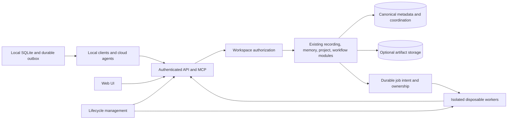

# Cloud lifecycle, tenancy, and storage hardening

Date: 2026-09-15
Status: proposed architecture and implementation plan; no replacement infrastructure provisioned

Publication update, 2026-09-20: the September 19 release added an opt-in local durable hook outbox
and an offline lifecycle rehearsal. See [durable capture](../../durable-capture.md) and
[local lifecycle](../../local-lifecycle.md). Neither establishes cloud synchronization, hosted
tenancy, or a live infrastructure controller. Provider observations below remain dated September 15.

## Recommendation

Build one managed application around **workspaces**, with isolated, disposable execution workers.
A person receives a personal workspace; a team can share one. Start with one hardened deployment
and make the same release deployable as a dedicated installation. Keep SQLite for local use and
PostgreSQL for the first hosted version. Evaluate DynamoDB against a bounded workload before
committing to a storage rewrite.

This separates four decisions that need not share the same boundary:

1. **Identity:** which people and agents can access a workspace?
2. **Data isolation:** shared tables, separate databases, or separate installations?
3. **Compute:** shared API capacity, dedicated API capacity, and short-lived workers?
4. **Lifecycle:** which resources stop, what data survives, and what still costs money?

SaaS does not require one physical application instance, and a separate database does not require
a server per user. A dedicated deployment is a packaging option, not a different product fork.
Planning assumption: a small private beta with a path to a managed product. Audience and service
targets remain product decisions, not confirmed user requirements.

## Immediate operational boundary

The Lightsail prototype was first paused on 2026-09-15, then permanently retired under separate
explicit owner authorization to discard its cloud-only data without a backup. CloudFormation
reached `DELETE_COMPLETE`; the container/database are absent from the live APIs and the three
dedicated credentials are marked for deletion in a no-charge recovery window. Private operator
notes and the Black Box handoff hold exact resource IDs and deletion receipts. Local data, source,
services and client routes are preserved. No replacement infrastructure was provisioned.

The earlier pause did not end Lightsail charges and would have allowed automatic database restart
after seven days. Retirement removes that running-resource obligation. This was explicit disposal
of a temporary prototype, not a demonstration of safe suspend/resume with retained customer data.
The lifecycle/recovery design below remains proposed work.

Source infrastructure is retained as a rebuild recipe. There is no active stack to resume; a
future `--apply` creates new paid resources. The first lifecycle implementation must still make
desired state explicit and prevent accidental wake-up or recreation during deployment.

## What the application actually supports

The current checkout is a feature-oriented Spring modular monolith with storage ports, a local
SQLite backend, and an optional PostgreSQL profile. Keep these module boundaries. Splitting the
code into network services would add work before resolving the actual correctness gaps.

| Current evidence | Hardening implication |
| --- | --- |
| `WebSecurityConfiguration` configures one in-memory browser user and one bearer token. | Introduce principals, workspace memberships, scoped agent credentials, and authorization. |
| `schema-postgres.sql` has no tenant columns; session uniqueness is global on source/client session ID. | Put workspace ownership in primary/foreign/unique keys and every data access path. |
| `EventBroadcaster` sends events to every authenticated subscriber in its process. | Scope notifications by authorized workspace; never rely on UI filtering. |
| `ProjectAliasService` serializes alias mutations with a JVM-local synchronized method. | Enforce graph mutation invariants transactionally before adding replicas. |
| `RunnerDaemon` uses a fixed actor and a local lock; `CrashRecovery` reasons from local tmux state. | Add unique run/worker identities and durable leases before multi-host execution. |
| Task claims use PostgreSQL row locks; completion and its Handoff commit atomically. | Preserve these transaction contracts under any database choice. |
| PostgreSQL schema setup uses idempotent creation rather than versioned migrations. | Add migration ownership, schema compatibility, and restore procedures before fleet upgrades. |
| PostgreSQL lexical search uses a LIKE fallback; vectors are ranked in Java. | Measure tenant-scoped recall and introduce indexes when justified; do not claim indexed full-corpus semantic search. |
| Transcript hydration, exports, and editor actions depend on server-local files. | Retain explicit local capabilities or move artifacts behind authorized storage/worker interfaces. |

Detailed current contracts: [architecture](../../architecture.md),
[PostgreSQL backend](../../postgres-backend.md), and
[Lightsail prototype](../../lightsail-prototype.md).

## Deployment options

| Model | Strength | Cost and limitation | Position |
| --- | --- | --- | --- |
| Application and database per workspace | Strong deployment isolation; straightforward customer export/restore; customer-owned hosting possible | Capacity, upgrades, backups, monitoring, and idle costs multiply; fleet automation becomes essential | Offer for explicit isolation requirements, not the default per human user |
| Shared app and shared database | Efficient pooling; simplest operations for a small managed product | Every path needs tenant isolation; quotas, noisy-neighbor control, and tenant restore need design | Preferred first managed deployment |
| Shared app and database per workspace | Clear data export/restore boundary; independent database lifecycle where supported | Connection pools, schema migrations, routing, and provider database quotas become fleet concerns; app remains shared | Strong alternative if per-workspace restore or isolation drives demand |
| Shared management service and bounded deployment groups | Each group hosts a limited set of workspaces; dedicated customers use a group of one | Routing, placement, and tenant migration add operational complexity | Design the workspace boundary now; implement placement only when needed |
| Local-first app with optional cloud workspace | Offline capture and private local context; cloud use can be selective | Requires a reliable outbox and explicit synchronization/conflict contract | Preserve as a supported product mode; current databases do not synchronize |

An instance-per-user design is attractive for intermittent usage only if idle compute genuinely
goes away and ownership of durable data remains safe. A VM with a stop button is insufficient if
its database, load balancer, storage, or platform plan keeps a substantial monthly minimum.

## Storage decision

### PostgreSQL: preferred near-term hosted store

The existing workload uses joins between events/sessions/projects, flexible filtering and
aggregates, alias and lineage relationships, and atomic capture/claim/completion. PostgreSQL
preserves these contracts through the existing JDBC adapter. Its server size and hosting model
are separate from its relational model.

Compare conventional managed PostgreSQL with a scale-to-zero PostgreSQL provider. The spike must
include wake-up latency, connection limits, connection-pool behavior, backup/restore, regional
availability, network isolation, and the full idle bill. Persistent pools, polling, scheduled
queries, or health probes can keep a supposedly idle database awake. Serverless is a billing and
execution model, not evidence that a service is free while unused.

| SQL hosting candidate | Documented behavior to test | Main qualification |
| --- | --- | --- |
| Conventional managed PostgreSQL | Steady running capacity and familiar operational model | Good predictable latency; fixed idle floor may conflict with intermittent use |
| Neon PostgreSQL | Default five-minute idle suspension; vendor describes typical wake-up in hundreds of milliseconds | Measure the entire Java/API wake path; storage and restore history remain billable; transaction-mode pooling restricts session state |
| Aurora Serverless v2 | Supported engine versions can scale to zero ACUs; AWS describes typical resume around 15 seconds, sometimes 30+ after a long pause | Verify exact engine/region; open connections or RDS Proxy can prevent pause; storage and supporting AWS resources still cost money |

These are provider-documented behaviors, not Black Box benchmark results. Neon pooled connections
use transaction-mode PgBouncer: use transaction-scoped tenant context, and a direct connection for
migrations or features requiring a persistent session. Audit JDBC connection settings and
background work instead of assuming the database will become idle beneath a running app.

### DynamoDB: credible for known access patterns, not a drop-in replacement

Good candidates include workspace-keyed append ingestion, event-by-ID lookup, bounded timelines,
idempotency records, and a small lifecycle registry. Conditional writes and transactions can
support ownership and state changes; absence of SQL does not mean absence of transactions.

The tradeoff is that current joins, rollups, flexible filters, aliases, text search, and vector
recall need explicitly designed projections or companion indexes. DynamoDB items have a 400 KB
limit, so large bodies need object storage references and a publication/recovery protocol.
Indexes introduce cost, rebuild work, and consistency choices. A table scan is not a substitute
for an indexed interactive query, and server-side filters do not avoid read costs for evaluated
items. Transaction design must account for the 100-item/4 MB transaction limits.

Current DynamoDB supports native approximate vector search; do not dismiss it based on an obsolete
claim that it cannot search vectors. Its vector indexes update asynchronously, support on-demand
tables, and currently have equality-only inline filters. Time-windowed recall needs a deliberate
query design. IAM `LeadingKeys` conditions do not apply to `SearchVectors`; enforce workspace
search scope in the trusted application or use a stronger index/table isolation boundary. Test
the exact region, SDK and provider capabilities before choosing this path.

A meaningful spike must implement these same behaviors in both candidates:

1. Idempotent event capture and lookup by stable operation ID.
2. Workspace/project timeline with pagination, time ranges, and session context.
3. Structured recall and representative search/facet queries.
4. Concurrent task claim and atomic completion plus Handoff, including failure midway.
5. Cross-workspace rejection, bulk export, retention, and delete/replay behavior.

Record latency, request units or database usage, storage/index costs, code complexity, and recovery
behavior on representative **synthetic** data. Do not upload private history for a benchmark.
Choose DynamoDB if the measured workload and operating model justify the redesigned access paths.
Do not add it alongside PostgreSQL merely to fill a diagram.

### SQLite per workspace / managed SQLite

This is a real middle option for small isolated workspaces: retain relational queries with a
smaller database unit. A durable single-writer service or managed provider can host separate
databases while API capacity is shared or resumed on demand.

Required proof: exclusive writer ownership, connection/transaction compatibility, consistent
backup and restore, crash recovery, database placement, and migrations across multiple databases.
Do not mount one SQLite file on arbitrary replicas, copy a live WAL database as an ordinary file,
or use a disposable container filesystem as the authoritative store.

An earlier 2026-09-08 Turso investigation found useful libSQL engine compatibility but failures in
the tested Java/Spring JDBC transaction and parameterized-update path. That is a dated result for
specific artifacts. Recheck the exact proposed client and hosted engine with the existing
transaction preservation suite before deciding; do not treat a vendor feature page as proof of
compatibility, or remove transactions to fit a client.

Current Turso documentation distinguishes its SQLite-compatible libSQL engine from the newer Turso
Database rewrite, which has different concurrency and full-text-search implementation. Name the
engine as well as the client in the spike. SQLite and libSQL are still relational; their appeal
here is the smaller operational unit, not eliminating the relational data model.

### Object storage

Use object storage for transcript/artifact bodies, worker outputs, exports, and backups when those
features need it. Keep tenant authorization, content hashes, retention rules, and object references
in authoritative metadata. Finalize a body/reference through an idempotent staged publication
protocol and collect abandoned uploads. Object storage alone does not replace interactive query
and coordination state without deliberately narrowing the product into an archive.

## Proposed application shape

These boxes describe responsibilities, not a requirement for a microservice per box. The API
remains a modular monolith. Jobs are asynchronous; long HTTP connections never own their lifetime.
The cloud relay and synchronization remain proposed. An opt-in local hook outbox now retries
acknowledged event capture; it does not synchronize separate databases.

## Instance lifecycle contract

### Compute candidates to validate

| Candidate | Fit | Lifecycle/cost question |
| --- | --- | --- |
| Existing Lightsail Containers | Preserve as a historical implementation/rebuild reference | Disable is operationally useful but does not remove its monthly charge |
| ECS/Fargate | AWS container path for the existing Java app and separately bounded workers | Task count can reach zero, but startup needs an external control/demand signal; load balancer, networking, logs, and storage costs remain separate |
| Request-driven containers such as Cloud Run | Alternative if changing cloud provider is acceptable; HTTP requests can wake capacity from zero | Verify Java cold start, background-job separation, connection pooling, and reconnect behavior under the platform's finite request timeout |

AWS-first recommendation: prove explicit Fargate pause/resume on a disposable environment and price
the complete routing/network/database footprint before adopting it. Do not equate task count zero
with a zero bill or assume an HTTP request to an empty target group wakes ECS. A persistent SSE
connection is active work for request-driven platforms and can prevent idle behavior; the client
must tolerate disconnect/reconnect. Cloud Run is an option to compare, not a selected migration.

### State and behavior

Expose a small CLI/API with `status`, `plan`, `provision`, `resume`, `pause`, `snapshot`, `restore`,
and a separate destructive `destroy`. Start with operator-driven commands. Automate idle detection
after explicit pause/resume is reliable. These are proposed commands, not commands available now.

Persist desired state, observed state, operation ID, workspace/deployment identity, release digest,
schema version, durable resource references, backup reference, and last failure. Secrets remain in
the credential store; the manifest holds references only. Serialize mutations per deployment and
make retries reconcile partial outcomes rather than provision duplicates.

`RUNNING -> DRAINING -> PAUSED -> STARTING -> RUNNING`, with explicit failed-operation state.

- **Pause:** close admission to new work and worker claims while allowing already-authorized,
  fenced completion/checkpoint writes for accepted jobs. Drain in-flight captures and jobs to a
  deadline; on timeout retain the last durable checkpoint, invalidate worker leases, and leave
  explicit recovery-required state. Confirm durable commits before closing streams and stopping
  compute. Late workers must not commit through an expired fence.
- **Resume:** establish storage readiness and exclusive ownership where needed; run a compatible
  migration once; launch the exact image; verify authenticated capture/recall and isolation; open
  traffic only after readiness succeeds.
- **Offline clients:** retain captures in a local durable outbox with stable operation IDs; retry
  with deduplication after resume. Report pending versus acknowledged capture honestly.
- **Wake path:** if automatic wake is promised, a small independently available gateway/control
  surface must authenticate the request and trigger startup. A stopped API cannot wake itself.
  Initial implementation may require explicit operator resume and clearly report offline state.
- **Retire with retained data:** stop compute and remove selected recurring resources only after a
  verified recoverable backup and exact retirement review; retained data and metadata have their
  own costs. Explicitly authorized disposal without a backup follows the separate destroy path.
- **Destroy:** separate authority, exact tenant/resource targeting, retention semantics, and audit.

For shared SaaS, pausing one workspace blocks its writes/jobs and can release its workers; shared
API/database capacity continues serving others. Physical per-workspace compute suspension exists
only where compute is actually allocated per workspace. Do not promise an individual tenant can
stop the entire shared database.

## Implementation milestones and acceptance

| Milestone | Deliverable | Required proof |
| --- | --- | --- |
| 1. Repeatable environment lifecycle | Parameterized infrastructure, desired-state manifest, dry-run/apply commands, immutable release restore metadata; deployment respects paused state | Fresh synthetic environment; capture -> pause -> resume -> recall same ID; pause during an active job covers successful drain and deadline expiry; repeated/interrupted operations converge; no unrelated resources change |
| 2. Workspace isolation | Principal-bound identity, membership, scoped/revocable agent credentials, workspace keys/constraints, scoped streams and storage | Two workspaces with colliding client IDs; cross-workspace REST/MCP/direct-ID/search/vector/facet/lineage/export/SSE/worker access rejected; pool reuse does not leak context |
| 3. Durable capture and recovery | Stable capture IDs and outbox, versioned migrations, least-privilege runtime role, backups and restore runbook | Crash before/after commit and lost acknowledgment; no duplicate capture; restore into a fresh environment with counts/checksums and capture/recall/claim contracts; measure RPO/RTO |
| 4. Isolated execution | Unique run/worker identities, leases, fencing tokens, heartbeats, artifact checkpoints, scoped credentials and bounded concurrency | Kill/restart worker; stale owner cannot commit; another host cannot reset healthy work; duplicate completion rejected; tenant credentials and outputs stay isolated |
| 5. Hosted beta readiness | Selected network boundary, credential rotation, quotas, request bounds, audit/metrics, environment separation, tested release/migration compatibility | Auth/MCP/browser use; degraded storage and retry tests; sustained workload; restore exercise; staging/prod credentials, data and integrations remain distinct |
| 6. Evidence-based scaling | Storage comparison and idle/wake measurements; add replicas or dedicated deployments only on measured need | Same workload and failure cases across candidates; two-replica alias/session/notification correctness before enabling a second replica; full active/idle cost inventory |

Use a single API replica through the initial correctness work. For pooled PostgreSQL, consider row
level security as defense in depth, with a runtime role that cannot bypass it and transaction-scoped
tenant context. Tenant-scoped queries and negative tests remain mandatory. Database owners and
privileged roles must not silently defeat the intended isolation.

Separate development/test and customer production resources, credentials, datasets, and integration
targets. Prefer a separate production account when customer operation begins. Build once and
promote the same reviewed image; apply compatible versioned migrations with one owner. An image
rollback does not undo a destructive schema change.

## Decision gates and costs

Before choosing a platform, set acceptable cold-start latency, expected active workspaces and
capture rate, maximum body size, offline behavior, recovery-point/recovery-time objectives, data
region, and whether customers need team access or dedicated hosting. These values are not known
yet; avoid a precise capacity or monthly-price promise before measuring them.

Compare total monthly cost as: shared routing/control + active API compute + worker runtime +
database compute/request usage + storage/backups + indexes + network/egress + secrets/logs.
For dedicated installations, multiply the per-installation minimum by deployed workspaces, not
just concurrently active users. A saved database still costs storage even when compute is zero.

First implementation recommendation: lifecycle plus recovery proof using the current SQL contracts,
followed by workspace isolation. In parallel with that design, run a bounded scale-to-zero SQL and
Dynamo access-pattern spike. No commitment to a fleet controller, microservices, or database rewrite
is needed to take the next useful step.

## Primary sources checked 2026-09-15

- [Lightsail container billing, including disabled services](https://docs.aws.amazon.com/lightsail/latest/userguide/amazon-lightsail-container-services.html)
- [Lightsail stopped database billing](https://docs.aws.amazon.com/lightsail/latest/userguide/amazon-lightsail-frequently-asked-questions-faq-billing-and-account-management.html)
- [Lightsail stop and automatic restart after seven days](https://docs.aws.amazon.com/cli/latest/reference/lightsail/stop-relational-database.html)
- [Lightsail backup retention and deletion semantics](https://docs.aws.amazon.com/lightsail/latest/userguide/amazon-lightsail-faq-databases.html)
- [DynamoDB core components and item size](https://docs.aws.amazon.com/amazondynamodb/latest/developerguide/HowItWorks.CoreComponents.html)
- [DynamoDB query behavior](https://docs.aws.amazon.com/amazondynamodb/latest/developerguide/Query.html)
- [DynamoDB transactions](https://docs.aws.amazon.com/amazondynamodb/latest/developerguide/transaction-apis.html)
- [DynamoDB native vector indexes and filters](https://docs.aws.amazon.com/amazondynamodb/latest/developerguide/VectorSearch.html)
- [DynamoDB vector-search authorization](https://docs.aws.amazon.com/amazondynamodb/latest/developerguide/VectorSearch.Security.html)
- [PostgreSQL row security and bypass roles](https://www.postgresql.org/docs/current/ddl-rowsecurity.html)
- [Neon scale to zero](https://neon.com/docs/introduction/scale-to-zero)
- [Neon cost model](https://neon.com/docs/introduction/cost-optimization)
- [Neon transaction-mode pooling](https://neon.com/docs/connect/connection-pooling)
- [Aurora Serverless v2 auto-pause and resume](https://docs.aws.amazon.com/AmazonRDS/latest/AuroraUserGuide/aurora-serverless-v2-auto-pause.html)
- [Turso Cloud engine choices](https://docs.turso.tech/turso-cloud)
- [Turso extension differences](https://docs.turso.tech/sql-reference/extensions)
- [DynamoDB request pricing categories](https://aws.amazon.com/dynamodb/pricing/)
- [S3 consistency and atomicity boundaries](https://docs.aws.amazon.com/AmazonS3/latest/userguide/Welcome.html#ConsistencyModel)
- [AWS shared, dedicated, and mixed SaaS models](https://docs.aws.amazon.com/wellarchitected/latest/saas-lens/silo-pool-and-bridge-models.html)
- [ECS scaling to zero and demand signals](https://docs.aws.amazon.com/AmazonECS/latest/developerguide/service-auto-scaling.html)
- [Fargate billing boundaries](https://aws.amazon.com/fargate/pricing/)
- [Load balancer pricing](https://aws.amazon.com/elasticloadbalancing/pricing/)
- [Cloud Run request-driven autoscaling](https://docs.cloud.google.com/run/docs/about-instance-autoscaling)
- [Cloud Run request timeout](https://docs.cloud.google.com/run/docs/configuring/request-timeout)
