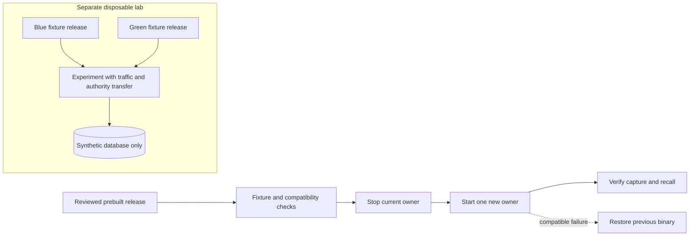

# Safer local upgrades, rollback, and an isolated blue-green learning lab

Status: draft design, 2026-10-02. The selected near-term direction is to strengthen the existing
single-active local upgrade path. Future blue-green operation and a disposable local Kubernetes
lab are proposals; Kubernetes adoption remains undecided. This document authorizes no installation,
cluster creation, proxy change, service-topology change, or application implementation.

## Outcome and current baseline

Make a reviewed release easy to install, verify, and recover from while preserving configuration,
recorded history, and captures accepted during an upgrade. Measure the actual interruption and
recovery window before choosing a more complex deployment model.

The recorded local acceptance checkpoint is release `ff38938`, deployed from a prebuilt artifact
with configuration, history, and retained legacy tables preserved. The integration owner reported
native backup verification and UI, lineage, capture, and recall checks. This design did not repeat
those live checks. The separate [snapshot and restore tooling](../../database-recovery.md) was
subsequently merged in PR #53, with native SQLite/WAL and PostgreSQL fixture acceptance. It is not
part of the deployed `ff38938` baseline and does not establish recovery of the installed database.

The implemented path is documented in [operations](../../operations.md#macos-launchd) and owned by
[`deploy_local.py`](../../../scripts/deploy_local.py), with fixture failures covered by
[`test_deploy_local.py`](../../../scripts/test_deploy_local.py):

- It updates an existing healthy macOS launchd installation, validates the Boot archive and loaded
  service identity, preserves the installed plist bytes, and rejects configuration disagreements.
- It locks the installation, retains a hashed previous JAR outside `target/`, stops the old process,
  verifies that JAR consumers are gone, atomically installs the candidate, and restarts using the
  unchanged plist. Prebuilt mode avoids building while the service is stopped.
- Its readiness check requires the exact new process to own the port and return HTTP 200 with
  canonical event/session counts. Handled build, install, startup, readiness, or interruption
  failures trigger verified binary rollback; the command still exits as failed after rollback.
- External configuration files and commands are not fingerprinted or restored. There is no database
  snapshot/restore in this deployment script, no traffic drain protocol, and no multi-server
  authority transfer. An uncatchable termination can require the documented manual recovery.

The [architecture](../../architecture.md) is one Spring Boot process with SQLite by default. The
[PostgreSQL profile](../../postgres-backend.md#behavior-and-limits) keeps one authoritative API
replica; selecting PostgreSQL does not add replication coordination or history synchronization.
The Board/runner is retired, but deleting old task tables remains an independent explicit operation;
keep `SBA_RETIRE_WORKFLOW=false` for these rehearsals. See [retirement](../../board-retirement.md).

## Compare the paths

| Path | Benefit | Cost and safety boundary | Recommended role |
| --- | --- | --- | --- |
| Prebuilt, single-active local upgrade | Builds/tests finish before the stop window; existing binary recovery and service identity checks | A measured interruption remains; startup and later writes can make old code incompatible | Default next operational improvement |
| Future blue-green | Candidate validation and potentially shorter traffic interruption; an old binary remains available | Requires compatible schema, exclusive write/job authority, traffic admission/drain, authentication and reconnect handling; two warm runtimes cost more | Separate experiment after authority and rollback contracts exist |
| Disposable local Kubernetes lab | Learn image rollout, probes, Services, shutdown, storage, and fault recovery in a reproducible environment | Adds cluster/runtime, images, configuration and resource overhead; does not itself solve database compatibility or writer fencing | Optional learning environment, isolated from the running installation |

No downtime, startup duration, CPU/RAM cost, or resource headroom has been measured for the proposed
paths. Two processes on one laptop also do not provide host-level availability. Choose complexity
from measured needs and learning value, not from the presence of a deployment feature.

There is no connection from the lab to the live canonical database, hooks, credentials, or service.
The lab diagram is a proposed experiment, not an implemented topology.

## Strengthen the existing path first

A future release checklist/receipt should bind the source revision, candidate JAR hash, frontend
assets, tested configuration shape, schema compatibility decision, prior JAR hash, and the selected
snapshot metadata. Store operational receipts privately: service definitions and configuration can
contain secrets. Record configuration names and protected references rather than secret values.
Do not claim a source commit alone identifies the bytes actually installed.

Before stopping, build in an isolated checkout, run the relevant suites, and exercise the candidate
against disposable fixtures or a protected backup copy. Use independent ports and disable provider
calls, exports, editor actions, and other real destinations in fixtures. Existing source data must
not become the rehearsal target. A database opened by an application is not a protected backup:
startup can run schema creation, migrations, FTS/vector initialization, human-turn backfill, and
alias discovery. See [configuration](../../../src/main/resources/application.yml),
[recording startup](../../../src/main/java/dev/nathan/sbaagentic/recording/internal/adapter/out/sqlite/RecordingSqlStore.java),
[FTS initialization](../../../src/main/java/dev/nathan/sbaagentic/recording/internal/adapter/out/sqlite/EventFtsIndex.java),
and [alias discovery](../../../src/main/java/dev/nathan/sbaagentic/project/internal/application/ProjectAliasService.java).

Then use the existing prebuilt deployment procedure and retain its recovery directory. After its
process/status check, perform a small authenticated or local capture-to-recall test, exact-project
isolation, one existing source/lineage navigation, and UI asset/version checks. Review capture
outbox replay and counts through canonical reads, not just a successful HTTP response. Define
acceptance before the live operation; do not create unbounded diagnostic captures in real history.

The current local deploy script probes `/api/status` without credentials. With authentication
enabled, that route requires authentication; this script must not be assumed to manage such an
installation successfully. A future authenticated deployment path needs a protected credential
channel and a separate capability smoke test, without weakening authentication or printing tokens.
Public actuator health endpoints have a different contract. See
[security configuration](../../../src/main/java/dev/nathan/sbaagentic/platform/internal/adapter/in/web/security/WebSecurityConfiguration.java)
and [authentication](../../authentication.md).

## Binary rollback and database recovery are different operations

| Situation | Appropriate response | Required evidence |
| --- | --- | --- |
| Candidate fails before changing stored state | Restore the previous verified binary through the existing procedure | Previous artifact/config identity, stopped candidate, healthy restored process |
| Candidate made compatible writes or additive schema changes | Restore old code against the current database only when backward compatibility is demonstrated | Old reader/writer works against new schema and new records; new accepted captures remain visible |
| Candidate changed storage incompatibly | Stop further writes; choose a reviewed forward fix or separate data recovery | Exact changed schema/data, snapshot cutoff, post-snapshot write inventory, owner-approved reconciliation/loss decision |
| Snapshot restore is selected | Preserve the affected database and restore into a fresh isolated target first | Checksum plus native restore/application tests; explicit plan for every capture accepted after the snapshot |

The current automatic rollback restores only the JAR. Therefore a release that could make the old
binary unsafe must be rejected **before** relying on this deployment path. Do not discover schema
incompatibility by repeatedly starting the old binary on the live database.

Prefer additive, expand-then-contract schema evolution with an explicitly tested rollback window.
Keep destructive changes, including legacy-table retirement, out of an ordinary binary upgrade.
Test old code reading new rows and performing new writes; a successful old-code startup is not
sufficient. Defer dropping columns/tables or changing encoded meaning until the rollback window is
closed deliberately. Versioned contracts include capture receipts/digests, aliases, replacement
relations, timestamp precision, raw JSON, BLOB/vector bytes, IDs, and null-versus-empty values.

A snapshot represents one point in time. Restoring it can discard later acknowledged writes. An
outbox may already have removed acknowledged items, so replay cannot be assumed to reconstruct
that interval. Before recovery, stop write admission and background mutations, preserve both the
affected database and queues, record the last accepted capture boundary, and reconcile post-snapshot
records without changing their identities. Reuse idempotent receipt semantics only where proven;
do not invent a generic replay guarantee. See [durable capture](../../durable-capture.md).

SQLite recovery must use a protected read-only master and a new destination with no existing DB or
WAL/SHM/journal sidecars. Do not copy only the main file of a running WAL database. Preserve native
virtual/shadow state and test FTS/vector use. PostgreSQL recovery scope must state whether an
artifact covers one schema or a whole database/cluster; roles, extensions, external schemas and
large objects may need separate treatment. Transcript files, capture outboxes, companion ledgers,
credentials and configuration remain separate. The database recovery guide supplies the concrete
snapshot and fixture procedures; this spec adds no restore command or live recovery authorization.

## Preconditions for future blue-green

Blue-green means two release slots and an explicit cutover. It does not mean two current Black Box
processes may freely share one canonical database. A green process that receives no HTTP traffic
can still mutate storage during startup or background activity. The existing per-installation deploy
lock also does not fence another application process started outside that script.

The first candidate exercise should use a disposable database copy. That copy can validate behavior
but cannot become authoritative after the live database has accepted more writes; promoting it
without a measured, lossless catch-up protocol would lose history. Do not implement ad hoc SQLite
file copying or bidirectional synchronization to bridge that gap.

Before a shared-store experiment, design and test all of these capabilities as new work:

1. **Exclusive authority.** One owner may accept canonical writes, run migrations/backfills, discover
   aliases, perform judgments/embedding work, or execute mutating exports/summary work. Define an
   enforceable lease/fencing or equivalent ownership mechanism. A stale owner must fail closed even
   while its process still runs; a routing selector, readiness bit, or local mutex is insufficient.
   The first safe experiment may stop the old owner before starting the new one and accept a gap.
2. **Compatible storage.** Both versions must tolerate the schema/records throughout the cutover and
   rollback window. Migration execution must have one owner. A standby/read-only application mode
   is proposed, not a currently available switch; prove every startup and background path before
   allowing a standby to inspect the live store.
3. **Ordered cutover.** Validate green privately, close old admission, drain or safely reject
   in-flight mutations, establish their commit/receipt outcomes, disable old background authority,
   fence old ownership, activate green, verify it, then route new requests. Decide how clients see
   and retry the bounded gap. Test failures between every step and rollback after new writes.
4. **Readiness and drain.** Readiness must include the chosen storage/schema/authority prerequisites;
   liveness must not restart a healthy process because an optional model/index is unavailable.
   An actual functional fixture must demonstrate capture and recall. Set shutdown/drain deadlines
   from measurements and bound long-lived SSE separately from mutating requests.
5. **Authentication and configuration.** Keep external origins, bearer destination binding, TLS,
   cookies, CSRF, redaction, transcript paths, provider settings, and extension versions explicit.
   Authentication uses in-memory browser sessions today, so a cutover/restart can require login.
   Shared sessions or sticky routing would be additional design choices, not assumptions.

SSE already closes emitters at shutdown and supports bounded event replay using `Last-Event-ID`
or `since`; the browser uses a native `EventSource`. These are useful building blocks, not proof of
seamless cutover. Existing connections may remain attached to the old process after new traffic
moves. Test stream closure, reconnect, authentication expiry, duplicates, cursor gaps, and a gap
larger than the replay window. Re-read canonical REST state after gaps; the current shared frontend
stream handler changes connection status but does not by itself refresh every page on reconnect.
See [stream shutdown](../../../src/main/java/dev/nathan/sbaagentic/platform/internal/adapter/in/sse/EventBroadcaster.java),
[replay](../../../src/main/java/dev/nathan/sbaagentic/platform/internal/adapter/in/sse/StreamController.java),
and [frontend stream handling](../../../frontend/src/lib/sse.ts).

## Disposable local Kubernetes learning lab

The purpose is to learn and measure these mechanisms without depending on Kubernetes for daily
capture. A dedicated `kind` cluster is one candidate because it supports named disposable clusters,
local image loading, and a separate kubeconfig. The runtime, distribution, versions and installation
remain owner decisions; no tools or clusters were inspected or installed for this design. Use the
[official kind guide](https://kind.sigs.k8s.io/docs/user/quick-start/) when preparing a separately
approved lab, and pin the tested image/version rather than using a floating release.

The proposed lab boundary requires a separate cluster and kubeconfig with explicit context checks,
synthetic credentials, synthetic captures, a dedicated fixture database/volume, and loopback-only
access. A namespace alone is not the intended isolation boundary. No host mounts of live databases,
transcripts, outboxes, credential stores or home directories; no privileged container or runtime
socket mount. Disable external providers and exports and prevent lab traffic from reaching real
capture/model destinations. Choose and verify the available network-control mechanism rather than
assuming a NetworkPolicy manifest is enforced by every local networking setup.

Begin with one active application replica and isolated fixture storage. A Kubernetes Deployment's
default rolling update can overlap old and new Pods. `Recreate` orders replacement during an
upgrade, but its documented guarantees do not cover every Pod replacement scenario; neither it nor
`replicas: 1` is database fencing. The lab must detect/refuse overlapping writer ownership or remain
limited to a manually verified one-owner fixture sequence. See
[Deployment strategies](https://kubernetes.io/docs/concepts/workloads/controllers/deployment/#strategy).

Use startup probes for slow initialization, readiness to control eligibility for new Service
traffic, and liveness for the process's ability to make progress. Probe configuration does not add
missing application readiness semantics or stop background writes. A Service selector updates the
eligible endpoint set; it is not a transaction boundary or a guarantee that existing connections
have drained. Pod termination has a finite grace period, so measure shutdown and SSE behavior
before choosing it. See [probe semantics](https://kubernetes.io/docs/tasks/configure-pod-container/configure-liveness-readiness-startup-probes/),
[Services](https://kubernetes.io/docs/concepts/services-networking/service/), and
[Pod termination](https://kubernetes.io/docs/concepts/workloads/pods/pod-lifecycle/#pod-termination).

A local PVC is fixture persistence, not a backup or evidence of cross-node database safety. Volume
access modes alone do not establish exclusive application write authority. Document the chosen
storage driver's behavior and how to discard only lab resources; no shared-cluster cleanup or
live-volume attachment is acceptable. See [persistent volume access modes](https://kubernetes.io/docs/concepts/storage/persistent-volumes/#access-modes).

Only after the single-owner lab passes should a blue/green pair with disjoint labels and controlled
traffic switching be considered. Use synthetic PostgreSQL if the experiment needs a shared store;
that does not waive the application's one-owner requirement. Keep browser/TLS testing explicit:
the cloud image requires secure cookies/authentication, so a plaintext browser lab is not evidence
for that image's HTTPS behavior. A local port-forward demonstration is not production ingress,
proxy buffering, certificate, or mobile acceptance.

## Staged experiments and acceptance

| Stage | Experiment | Acceptance evidence | Stop condition |
| --- | --- | --- | --- |
| 1. Baseline | Rehearse the existing prebuilt stop/start/rollback path on disposable service fixtures | Candidate/prior hashes, preserved config, exact process/port identity, interruption timings, capture/recall and restart | Ambiguous process ownership, unexpected config, unverified rollback |
| 2. Data compatibility | Restore protected snapshots into fresh fixtures; run new and old code against compatible/new records | Native typed data, FTS/vector behavior, receipts, aliases, replacement history, lineage, new capture and replay | Lost/changed acknowledged data, stale sidecars, destructive schema action, old-code incompatibility |
| 3. Failure timing | Interrupt install/start/first-write and exercise bounded client retries | Durable acceptance identified, no duplicate logical capture, queues retained, preserved post-snapshot writes | Unknown write outcomes that cannot be reconciled or a recovery requiring unapproved data loss |
| 4. Single-owner Kubernetes lab | Once separately authorized, rehearse startup, probe failure, restart, shutdown, image rollback and fixture restore | One observed/fenced authority, repeatable cleanup, functional checks, CPU/RAM/disk and startup/drain measurements | Any live destination/credential/volume touched, resource budget exceeded, overlapping writers |
| 5. Blue-green lab | After authority controls exist, transfer ownership and traffic with active writes and SSE | No lost acknowledged capture; stable identities/idempotency; reconnect plus canonical refresh; old owner cannot write after transfer | Split authority, unbounded drain, incompatible schema/session behavior, unsafe fallback |

Record p50/p95 startup and unavailable-window timings over repeated runs, failed/queued capture
counts, replay delay, new-write rollback behavior, resources at idle/upgrade, and recovery duration.
Set concrete limits before each experiment; do not retrofit passing thresholds after seeing results.
This document defines experiments only and does not report them as executed.

## Owner decisions and the Kubernetes adoption gate

The following remain open:

- The acceptable upgrade interruption and recovery time, permitted data-loss budget, and policy for
  preserving/reconciling captures acknowledged after a snapshot. Do not infer permission to lose data.
- How long prior binaries, protected snapshots and private recovery receipts are retained; where
  encrypted/protected artifacts live; who verifies restoration and approves destructive migrations.
- Whether shorter interruption is actually needed, and whether a bounded single-owner pause meets
  that need before investing in standby mode, fencing, traffic controls and shared sessions.
- Whether the Kubernetes lab is desired now; runtime/distribution, pinned versions, machine resource
  and maintenance budget, allowed network access, TLS/browser scope and cleanup owner.
- What measured benefit would justify operating Black Box on Kubernetes: a real multi-service or
  deployment need, repeated reproducible operations, or an explicit ongoing learning objective.

Adopt Kubernetes for the application only after the isolated experiments demonstrate a concrete
benefit over the existing single-active path and the owner accepts its measured resource/security/
maintenance cost. More replicas, storage objects, or rollout controls alone do not justify adoption.
The recorded [personal-cloud direction](2026-09-29-personal-cloud-black-box-design.md) remains separate;
this local learning spec does not reopen provider/region choices or authorize a cloud migration.

## Design verification and handoff

This draft was checked against the current deployment source, operations/architecture/authentication
contracts, and the official Kubernetes/kind documentation linked above. Verification for this
change is limited to source consistency, Markdown links, privacy review, and diff checks. No
application tests, Kubernetes commands, installs, live probes, traffic switches or recovery commands
were run for this documentation-only slice.

Codex changed only this spec in an isolated checkout. Integration/review/publication belongs to the
coordinator. Next useful action: review the single-active release acceptance contract and choose
whether to authorize a bounded disposable lab. Installed-database recovery still needs its own
rehearsal; the merged backup-tool fixture evidence is not a substitute for that acceptance.
